# Pipeline Results

Customer Segmentation & Cluster-Based Marketing Notifications — UCI Online Retail II.

Each stage below shows a short description, the source code (click to expand), the result tables, and the figures. Generated by `build_github_report.py`.

## Contents

- [Stage 1 — Data Loading & Cleaning](#stage-1--data-loading--cleaning)
- [Stage 2 — Feature Engineering](#stage-2--feature-engineering)
- [Stage 2b — Preprocessing](#stage-2b--preprocessing)
- [Stage 3-4 — Clustering (4 algorithms)](#stage-3-4--clustering-4-algorithms)
- [Stage 3b — Validation & Stability](#stage-3b--validation--stability)
- [Stage 6 — Segment Profiling](#stage-6--segment-profiling)
- [Stage 7 — Customer Lifetime Value](#stage-7--customer-lifetime-value)
- [Stage 8 — Churn Classification](#stage-8--churn-classification)
- [Stage 9 — Segment Migration](#stage-9--segment-migration)
- [Stage 10 — Notification Engine](#stage-10--notification-engine)
- [Stage 11 — Monte Carlo ROI](#stage-11--monte-carlo-roi)
- [Stage 12 — Streamlit Dashboard](#stage-12--streamlit-dashboard)

---

## Stage 1 — Data Loading & Cleaning

Load both Excel sheets (2009-2010, 2010-2011), then clean: drop missing Customer IDs, cancellations, invalid quantity/price, and exact duplicates, recording an audit trail of every removal.

<details>
<summary>📄 View code: <code>src/data_loading.py</code> (90 lines)</summary>

```python
"""
Data loading module for the Online Retail II dataset.

The source workbook contains two sheets covering different calendar years.
Both sheets share an identical schema, so they are loaded separately, tagged
with a ``Year`` column to preserve provenance, and concatenated into a single
DataFrame that all downstream pipeline stages consume.

Keeping loading strictly separate from cleaning means each concern can be
tested, replaced, or re-run independently.
"""

from __future__ import annotations

import logging

import pandas as pd

from src.config import RAW_EXCEL_PATH, SHEET_2009_2010, SHEET_2010_2011

logger = logging.getLogger(__name__)

# Mapping of sheet name → value written into the ``Year`` column.
_SHEET_YEAR_MAP: dict[str, str] = {
    SHEET_2009_2010: "2009-2010",
    SHEET_2010_2011: "2010-2011",
}

# Explicit dtypes avoid silent coercion and speed up Excel parsing.
_DTYPE_MAP: dict[str, str] = {
    "Invoice": "str",
    "StockCode": "str",
    "Description": "str",
    "Country": "str",
}


def _load_sheet(sheet_name: str, year_label: str) -> pd.DataFrame:
    """Read one sheet from the raw Excel workbook and tag it with ``year_label``.

    Parameters
    ----------
    sheet_name:
        Exact name of the Excel sheet to read, as stored in ``config.py``.
    year_label:
        Human-readable string written into the ``Year`` column so downstream
        code can filter by source period if needed.

    Returns
    -------
    pd.DataFrame
        Raw, un-cleaned rows from the requested sheet with a ``Year`` column
        appended.
    """
    logger.info("Loading sheet '%s' from %s", sheet_name, RAW_EXCEL_PATH)
    df = pd.read_excel(
        RAW_EXCEL_PATH,
        sheet_name=sheet_name,
        dtype=_DTYPE_MAP,
    )
    df["Year"] = year_label
    logger.info("  -> %d rows loaded.", len(df))
    return df


def load_raw_data() -> pd.DataFrame:
    """Load and concatenate both annual sheets of the Online Retail II workbook.

    The two sheets cover 01/12/2009–09/12/2010 and 01/12/2010–09/12/2011
    respectively. Combining them gives a full two-year transaction history,
    which is the minimum horizon recommended for stable RFM and CLV estimates.

    Returns
    -------
    pd.DataFrame
        Combined raw DataFrame with columns:
        Invoice, StockCode, Description, Quantity, InvoiceDate, Price,
        Customer ID, Country, Year.
        The index is reset so it is contiguous across both sheets.
    """
    frames = [
        _load_sheet(sheet_name, year_label)
        for sheet_name, year_label in _SHEET_YEAR_MAP.items()
    ]
    combined = pd.concat(frames, ignore_index=True)
    logger.info(
        "Combined dataset: %d rows across %d sheets.", len(combined), len(frames)
    )
    return combined

```

</details>

<details>
<summary>📄 View code: <code>src/cleaning.py</code> (234 lines)</summary>

```python
"""
Cleaning module for the Online Retail II transaction data.

Each cleaning step is documented with the business or statistical reason for
the rule so the rationale is traceable back to this source file when writing
the methodology chapter.

Design choices
--------------
* Steps are applied sequentially so that each removal count is measured
  against the *already-filtered* dataset — this prevents double-counting rows
  that would have been removed by multiple rules.
* A summary DataFrame is built alongside the cleaning so the exact impact of
  every rule is recorded without requiring a second pass over the data.
* All thresholds come from ``src/config.py``; nothing is hard-coded here.
"""

from __future__ import annotations

import logging

import pandas as pd

from src.config import (
    CANCELLATION_PREFIX,
    CLEANED_PARQUET,
    DATA_PROCESSED_DIR,
    MIN_QUANTITY,
    MIN_UNIT_PRICE,
    OUTPUTS_TABLES_DIR,
)

logger = logging.getLogger(__name__)

# Output path for the row-removal audit table.
CLEANING_SUMMARY_CSV = OUTPUTS_TABLES_DIR / "cleaning_summary.csv"


# ---------------------------------------------------------------------------
# Internal helpers
# ---------------------------------------------------------------------------

def _record_step(
    summary_rows: list[dict],
    step: int,
    description: str,
    rows_before: int,
    rows_after: int,
) -> None:
    """Append one row to the running audit list."""
    removed = rows_before - rows_after
    pct = removed / rows_before * 100 if rows_before else 0.0
    summary_rows.append(
        {
            "Step": step,
            "Description": description,
            "Rows Before": rows_before,
            "Rows After": rows_after,
            "Rows Removed": removed,
            "% Removed": round(pct, 2),
        }
    )


def _print_summary(summary: pd.DataFrame) -> None:
    """Print a formatted audit table to stdout."""
    col_widths = {
        "Step": 4,
        "Description": 45,
        "Rows Before": 12,
        "Rows After": 11,
        "Rows Removed": 13,
        "% Removed": 10,
    }
    header = "  ".join(c.ljust(w) for c, w in col_widths.items())
    divider = "-" * len(header)
    print("\n" + divider)
    print("CLEANING SUMMARY")
    print(divider)
    print(header)
    print(divider)
    for _, row in summary.iterrows():
        line = "  ".join(
            str(row[c]).ljust(w) for c, w in col_widths.items()
        )
        print(line)
    print(divider)
    total_removed = summary["Rows Removed"].sum()
    initial = summary.iloc[0]["Rows Before"]
    final = summary.iloc[-1]["Rows After"]
    print(
        f"Total removed: {total_removed:,}  "
        f"({total_removed / initial * 100:.1f}% of raw data)  |  "
        f"Final dataset: {final:,} rows"
    )
    print(divider + "\n")


# ---------------------------------------------------------------------------
# Public API
# ---------------------------------------------------------------------------

def clean_transactions(df: pd.DataFrame) -> pd.DataFrame:
    """Apply the full cleaning pipeline to the raw combined transaction data.

    Each step below removes a distinct category of noise or invalid records.
    The docstring for each step explains *why* it is necessary so the
    rationale can be reproduced directly in the dissertation methodology.

    Parameters
    ----------
    df:
        Raw combined DataFrame produced by :func:`src.data_loading.load_raw_data`.

    Returns
    -------
    pd.DataFrame
        Cleaned DataFrame saved to ``data/processed/cleaned_transactions.parquet``
        and ready for feature engineering.

    Side effects
    ------------
    * Writes ``outputs/tables/cleaning_summary.csv``.
    * Prints a formatted summary table to stdout.
    * Saves a Parquet file to the path specified by ``config.CLEANED_PARQUET``.
    """
    summary_rows: list[dict] = []
    data = df.copy()

    # ------------------------------------------------------------------
    # Step 1 — Drop rows with missing Customer ID
    # ------------------------------------------------------------------
    # Customer ID is the primary key for all customer-level analyses (RFM,
    # CLV, segmentation). Rows without an ID cannot be attributed to any
    # customer and therefore contribute no signal to the model. Retaining
    # them would silently inflate basket-level aggregates while being
    # invisible in per-customer summaries, introducing an inconsistency
    # between transaction counts and customer counts.
    rows_before = len(data)
    data = data.dropna(subset=["Customer ID"])
    _record_step(summary_rows, 1, "Drop missing Customer ID", rows_before, len(data))

    # ------------------------------------------------------------------
    # Step 2 — Remove cancelled orders (Invoice starts with 'C')
    # ------------------------------------------------------------------
    # The UCI dataset encodes cancellations by prefixing the Invoice number
    # with the letter 'C'. Cancelled transactions record *negative* quantities
    # and represent reversed purchases that never generated revenue. Including
    # them would artificially deflate Monetary value in RFM and bias the
    # Frequency count, because a cancel + re-order pair would count as two
    # events rather than one. The matching original order is retained;
    # only the cancellation record is discarded.
    rows_before = len(data)
    is_cancellation = data["Invoice"].str.startswith(CANCELLATION_PREFIX)
    data = data[~is_cancellation]
    _record_step(
        summary_rows, 2, "Remove cancelled invoices (prefix 'C')", rows_before, len(data)
    )

    # ------------------------------------------------------------------
    # Step 3 — Remove non-positive Quantity or Price
    # ------------------------------------------------------------------
    # Quantity <= 0 that was not already removed by the cancellation filter
    # indicates data-entry errors, sample or test stock movements, or write-
    # offs — none of which represent genuine customer purchases. Price <= 0
    # (including free samples and manual adjustments with Price = 0) cannot
    # produce a valid Monetary value and would distort unit-price distributions
    # used in product-level profiling. Both conditions are filtered together
    # because they represent the same underlying problem: records that do not
    # correspond to a real sale at market price.
    rows_before = len(data)
    valid_qty = data["Quantity"] >= MIN_QUANTITY
    valid_price = data["Price"] >= MIN_UNIT_PRICE
    data = data[valid_qty & valid_price]
    _record_step(
        summary_rows,
        3,
        f"Remove Quantity < {MIN_QUANTITY} or Price < {MIN_UNIT_PRICE}",
        rows_before,
        len(data),
    )

    # ------------------------------------------------------------------
    # Step 4 — Drop exact duplicate rows
    # ------------------------------------------------------------------
    # Exact duplicates (all columns identical) are most likely the result of
    # double-loading one of the Excel sheets, ETL pipeline retries, or
    # upstream data-entry errors in the retailer's system. Keeping them would
    # inflate transaction counts and Monetary totals for affected customers,
    # biasing their RFM scores upward relative to customers whose records
    # contain no duplicates.
    rows_before = len(data)
    data = data.drop_duplicates()
    _record_step(summary_rows, 4, "Drop exact duplicate rows", rows_before, len(data))

    # ------------------------------------------------------------------
    # Step 5 — Derive TotalPrice = Quantity × Price
    # ------------------------------------------------------------------
    # TotalPrice is the line-level revenue figure used as the building block
    # for the Monetary dimension of RFM and for CLV estimation. Computing it
    # here — after all invalid rows have been removed — guarantees that no
    # negative or zero-revenue lines contaminate downstream aggregations.
    data["TotalPrice"] = data["Quantity"] * data["Price"]

    # ------------------------------------------------------------------
    # Step 6 — Enforce correct column dtypes
    # ------------------------------------------------------------------
    # InvoiceDate must be datetime64 for time-series grouping (Recency
    # calculation) and for BG/NBD model calibration which requires ordered
    # date arithmetic. Customer ID is cast to int after NaN removal; storing
    # it as float (the pandas default when NaNs are present) would silently
    # propagate floating-point representations into join keys, causing subtle
    # mismatches if the column is ever used in a merge with an integer-typed
    # key.
    data["InvoiceDate"] = pd.to_datetime(data["InvoiceDate"])
    data["Customer ID"] = data["Customer ID"].astype(int)

    # ------------------------------------------------------------------
    # Build and persist the audit summary
    # ------------------------------------------------------------------
    summary_df = pd.DataFrame(summary_rows)

    _print_summary(summary_df)

    OUTPUTS_TABLES_DIR.mkdir(parents=True, exist_ok=True)
    summary_df.to_csv(CLEANING_SUMMARY_CSV, index=False)
    logger.info("Cleaning summary saved to %s", CLEANING_SUMMARY_CSV)

    DATA_PROCESSED_DIR.mkdir(parents=True, exist_ok=True)
    data.to_parquet(CLEANED_PARQUET, index=False)
    logger.info("Cleaned data (%d rows) saved to %s", len(data), CLEANED_PARQUET)

    return data

```

</details>

**Results:**

*Cleaning Summary*

| Step | Description | Rows Before | Rows After | Rows Removed | % Removed |
| --- | --- | --- | --- | --- | --- |
| 1 | Drop missing Customer ID | 1067371 | 824364 | 243007 | 22.77 |
| 2 | Remove cancelled invoices (prefix 'C') | 824364 | 805620 | 18744 | 2.27 |
| 3 | Remove Quantity < 1 or Price < 0.01 | 805620 | 805531 | 89 | 0.01 |
| 4 | Drop exact duplicate rows | 805531 | 793591 | 11940 | 1.48 |


---

## Stage 2 — Feature Engineering

Build a customer-level table of RFM features plus four extended behavioural features (Tenure, AvgOrderValue, AvgInterPurchaseDays, DistinctProducts).

<details>
<summary>📄 View code: <code>src/features.py</code> (297 lines)</summary>

```python
"""
Customer-level feature engineering for the segmentation pipeline.

Transforms the cleaned line-item transaction table into one row per customer
containing eight behavioural features. The first three are the canonical RFM
dimensions; the remaining four extend RFM with purchasing-pattern signals that
help distinguish, for example, a high-spend one-off buyer from a frequent
low-spend loyal customer — a distinction that raw Monetary alone cannot make.

All intermediate aggregations are kept as separate named steps so each can be
unit-tested and so the derivation chain is transparent to a dissertation reader.

Snapshot date convention
------------------------
The snapshot date is set to ``max(InvoiceDate) + RFM_SNAPSHOT_DATE_OFFSET_DAYS``
rather than to today's date. This makes the Recency values fully reproducible
regardless of when the code is run — an essential property for an academic
project where results must be exactly replicable from the raw data file.
"""

from __future__ import annotations

import logging

import matplotlib
matplotlib.use("Agg")  # non-interactive backend; must come before pyplot import
import matplotlib.pyplot as plt
import pandas as pd

from src.config import (
    CLEANED_PARQUET,
    CUSTOMER_FEATURES_PARQUET,
    DATA_PROCESSED_DIR,
    OUTPUTS_FIGURES_DIR,
    OUTPUTS_TABLES_DIR,
    RFM_SNAPSHOT_DATE_OFFSET_DAYS,
)

logger = logging.getLogger(__name__)

FEATURE_SUMMARY_CSV = OUTPUTS_TABLES_DIR / "feature_summary.csv"
RFM_DISTRIBUTIONS_PNG = OUTPUTS_FIGURES_DIR / "rfm_distributions.png"


# ---------------------------------------------------------------------------
# Feature computation
# ---------------------------------------------------------------------------

def _compute_snapshot_date(df: pd.DataFrame) -> pd.Timestamp:
    """Return the analysis snapshot date: max InvoiceDate + configured offset.

    Using a fixed offset from the last observed transaction rather than the
    current calendar date ensures that Recency values are identical on every
    run, satisfying the reproducibility requirement of the dissertation.

    Parameters
    ----------
    df:
        Cleaned transaction DataFrame with a ``datetime64`` InvoiceDate column.
    """
    snapshot = df["InvoiceDate"].max() + pd.Timedelta(days=RFM_SNAPSHOT_DATE_OFFSET_DAYS)
    logger.info("Snapshot date: %s", snapshot.date())
    return snapshot


def _build_rfm(df: pd.DataFrame, snapshot: pd.Timestamp) -> pd.DataFrame:
    """Compute the three canonical RFM dimensions per customer.

    Recency
        Days between the customer's most recent purchase and the snapshot date.
        Lower values indicate more recently active customers. Recency is used
        as an inverse engagement signal: a customer who bought yesterday is more
        likely to respond to a marketing message than one who bought two years
        ago. Using elapsed days (rather than the raw date) converts the temporal
        dimension into a numeric feature compatible with distance-based
        clustering algorithms.

    Frequency
        Count of *unique* invoices attributed to the customer. Each invoice
        represents a distinct shopping session, so this measures behavioural
        engagement rather than product volume. Counting invoices rather than
        line items prevents customers who purchase many SKUs per basket from
        being artificially inflated relative to those who buy fewer products
        per visit.

    Monetary
        Sum of TotalPrice across all line items for the customer. This is the
        total revenue attributed to that customer over the observation window
        and serves as the primary value signal in the RFM framework. Using the
        sum (rather than the mean) captures the full economic contribution,
        which is appropriate for CLV-oriented segmentation.

    Parameters
    ----------
    df:
        Cleaned transaction DataFrame.
    snapshot:
        Analysis snapshot date produced by :func:`_compute_snapshot_date`.

    Returns
    -------
    pd.DataFrame
        Customer-indexed DataFrame with columns Recency, Frequency, Monetary.
    """
    rfm = (
        df.groupby("Customer ID")
        .agg(
            _last_purchase=("InvoiceDate", "max"),
            Frequency=("Invoice", "nunique"),
            Monetary=("TotalPrice", "sum"),
        )
        .reset_index()
    )
    rfm["Recency"] = (snapshot - rfm["_last_purchase"]).dt.days
    rfm = rfm.drop(columns=["_last_purchase"])
    return rfm


def _build_extended(df: pd.DataFrame, rfm: pd.DataFrame) -> pd.DataFrame:
    """Append four extended behavioural features to the RFM base table.

    Tenure
        Number of days between a customer's first and last recorded purchase.
        Tenure distinguishes long-standing loyal customers from recent high-
        spenders who have the same Recency but fundamentally different
        relationship histories with the retailer. It also acts as the
        denominator for AvgInterPurchaseDays, making that feature meaningful.

    AvgOrderValue
        Monetary divided by Frequency (mean revenue per shopping session).
        Two customers with identical Monetary can have very different purchasing
        styles: one may make many small purchases, the other a few large ones.
        AvgOrderValue exposes this distinction and is used in segment profiling
        to identify premium vs. volume buyers.

    AvgInterPurchaseDays
        Tenure divided by Frequency (mean gap in days between purchases).
        This is a proxy for purchase cadence and is particularly useful for
        identifying customers whose buying rhythm could inform the timing of
        marketing notifications. For one-time buyers (Frequency = 1) the value
        is zero, reflecting the absence of a repeat-purchase interval; these
        customers form a distinct strategic group regardless.

    DistinctProducts
        Count of unique StockCodes purchased by the customer across all
        transactions. Breadth of assortment signals cross-category engagement
        and distinguishes niche enthusiasts (low DistinctProducts, high
        Monetary) from exploratory shoppers (high DistinctProducts, moderate
        Monetary). This is not captured by any standard RFM dimension.

    Parameters
    ----------
    df:
        Cleaned transaction DataFrame.
    rfm:
        Base RFM table produced by :func:`_build_rfm`.

    Returns
    -------
    pd.DataFrame
        Combined feature table with all eight columns.
    """
    extras = (
        df.groupby("Customer ID")
        .agg(
            _first_purchase=("InvoiceDate", "min"),
            _last_purchase=("InvoiceDate", "max"),
            DistinctProducts=("StockCode", "nunique"),
        )
        .reset_index()
    )
    extras["Tenure"] = (extras["_last_purchase"] - extras["_first_purchase"]).dt.days
    extras = extras.drop(columns=["_first_purchase", "_last_purchase"])

    features = rfm.merge(extras, on="Customer ID", how="left")
    features["AvgOrderValue"] = features["Monetary"] / features["Frequency"]
    # For customers with Frequency == 1, Tenure is 0 → AvgInterPurchaseDays = 0.
    # This is intentional: one-time buyers have no inter-purchase interval.
    features["AvgInterPurchaseDays"] = features["Tenure"] / features["Frequency"]

    col_order = [
        "Customer ID",
        "Recency",
        "Frequency",
        "Monetary",
        "Tenure",
        "AvgOrderValue",
        "AvgInterPurchaseDays",
        "DistinctProducts",
    ]
    return features[col_order]


# ---------------------------------------------------------------------------
# Visualisation
# ---------------------------------------------------------------------------

def _plot_rfm_distributions(features: pd.DataFrame) -> None:
    """Save a three-panel histogram of the R, F, M distributions.

    The distributions are plotted on a log-scale x-axis for Frequency and
    Monetary because both are heavily right-skewed (a small number of
    customers account for a disproportionate share of transactions and
    revenue). Log-scaling keeps the bulk of the distribution visible rather
    than compressing it against the y-axis. Recency is plotted on a linear
    scale because it is naturally bounded and closer to uniform.

    The figure is saved to ``outputs/figures/rfm_distributions.png`` and is
    not displayed interactively (the ``Agg`` backend is used so the pipeline
    can run headlessly on a server).

    Parameters
    ----------
    features:
        Customer feature table containing at least Recency, Frequency,
        and Monetary columns.
    """
    fig, axes = plt.subplots(1, 3, figsize=(14, 4))
    fig.suptitle("RFM Feature Distributions", fontsize=13, fontweight="bold", y=1.01)

    panels = [
        ("Recency", "Days since last purchase", "steelblue", False),
        ("Frequency", "Number of unique invoices", "darkorange", True),
        ("Monetary", "Total spend (£)", "forestgreen", True),
    ]

    for ax, (col, xlabel, colour, log_scale) in zip(axes, panels):
        data = features[col].dropna()
        ax.hist(data, bins=60, color=colour, edgecolor="white", linewidth=0.3)
        ax.set_xlabel(xlabel, fontsize=10)
        ax.set_ylabel("Number of customers", fontsize=10)
        ax.set_title(col, fontsize=11, fontweight="bold")
        if log_scale:
            ax.set_xscale("log")
            ax.set_xlabel(f"{xlabel} (log scale)", fontsize=10)
        median_val = data.median()
        ax.axvline(median_val, color="red", linestyle="--", linewidth=1.2,
                   label=f"Median: {median_val:,.1f}")
        ax.legend(fontsize=9)
        ax.spines[["top", "right"]].set_visible(False)

    plt.tight_layout()
    OUTPUTS_FIGURES_DIR.mkdir(parents=True, exist_ok=True)
    fig.savefig(RFM_DISTRIBUTIONS_PNG, dpi=150, bbox_inches="tight")
    plt.close(fig)
    logger.info("RFM distribution plot saved to %s", RFM_DISTRIBUTIONS_PNG)


# ---------------------------------------------------------------------------
# Public API
# ---------------------------------------------------------------------------

def build_customer_features() -> pd.DataFrame:
    """Build the full customer-level feature table from cleaned transactions.

    Reads the cleaned parquet artefact produced by :mod:`src.cleaning`,
    computes all eight features, and writes the result to
    ``data/processed/customer_features.parquet``.

    Returns
    -------
    pd.DataFrame
        One row per customer with columns:
        Customer ID, Recency, Frequency, Monetary, Tenure,
        AvgOrderValue, AvgInterPurchaseDays, DistinctProducts.

    Side effects
    ------------
    * Writes ``data/processed/customer_features.parquet``.
    * Writes ``outputs/tables/feature_summary.csv`` (describe() output).
    * Writes ``outputs/figures/rfm_distributions.png``.
    """
    logger.info("Loading cleaned transactions from %s", CLEANED_PARQUET)
    df = pd.read_parquet(CLEANED_PARQUET)
    logger.info("  -> %d transaction rows, %d unique customers.",
                len(df), df["Customer ID"].nunique())

    snapshot = _compute_snapshot_date(df)
    rfm = _build_rfm(df, snapshot)
    features = _build_extended(df, rfm)

    logger.info("Feature table shape: %s", features.shape)

    # ── Persist outputs ────────────────────────────────────────────────────
    DATA_PROCESSED_DIR.mkdir(parents=True, exist_ok=True)
    features.to_parquet(CUSTOMER_FEATURES_PARQUET, index=False)
    logger.info("Customer features saved to %s", CUSTOMER_FEATURES_PARQUET)

    OUTPUTS_TABLES_DIR.mkdir(parents=True, exist_ok=True)
    summary = features.describe().T
    summary.to_csv(FEATURE_SUMMARY_CSV)
    logger.info("Feature summary saved to %s", FEATURE_SUMMARY_CSV)

    _plot_rfm_distributions(features)

    return features

```

</details>

**Results:**

*Feature Summary*

|  | count | mean | std | min | 25% | 50% | 75% | max |
| --- | --- | --- | --- | --- | --- | --- | --- | --- |
| Customer ID | 5878.0 | 15315.313542021097 | 1715.5726659295858 | 12346.0 | 13833.25 | 15314.5 | 16797.75 | 18287.0 |
| Recency | 5878.0 | 201.331915617557 | 209.33870672957298 | 1.0 | 26.0 | 96.0 | 380.0 | 739.0 |
| Frequency | 5878.0 | 6.289384144266758 | 13.009405882310157 | 1.0 | 1.0 | 3.0 | 7.0 | 398.0 |
| Monetary | 5878.0 | 3008.754783940116 | 14731.92411287431 | 2.95 | 345.115 | 887.39 | 2298.005 | 608821.65 |
| Tenure | 5878.0 | 273.02245661789726 | 258.8075911600813 | 0.0 | 0.0 | 220.5 | 511.0 | 738.0 |
| AvgOrderValue | 5878.0 | 389.9924443732805 | 1215.0079883421538 | 2.95 | 179.45 | 283.60833333333335 | 419.6700000000001 | 84236.25 |
| AvgInterPurchaseDays | 5878.0 | 50.1528739627676 | 54.85067474043867 | 0.0 | 0.0 | 36.64583333333333 | 76.08333333333334 | 357.0 |
| DistinctProducts | 5878.0 | 81.98656005444029 | 116.48276904242869 | 1.0 | 19.0 | 45.0 | 103.0 | 2550.0 |


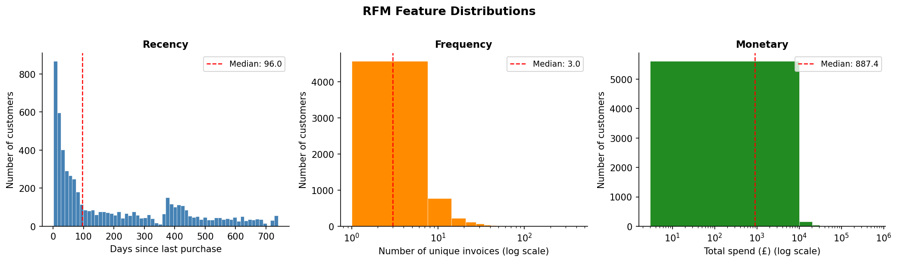


---

## Stage 2b — Preprocessing

Apply log1p to skewed features (|skew| > 0.5), then StandardScaler so every feature contributes equally to distance-based clustering.

<details>
<summary>📄 View code: <code>src/preprocessing.py</code> (303 lines)</summary>

```python
"""
Feature preprocessing for distance-based clustering.

Why scaling is essential for K-Means and DBSCAN
------------------------------------------------
Both K-Means and DBSCAN rely on Euclidean distance (or, for HDBSCAN, a
density estimate derived from it) to measure similarity between customers.
Euclidean distance is dominated by whichever feature has the largest
numerical range: without scaling, Monetary (£3 – £608 K) would completely
overwhelm Recency (1 – 739 days), reducing the effective dimensionality to
one and making the chosen k meaningless. StandardScaler removes this bias by
transforming every feature to zero mean and unit variance, so each dimension
contributes equally to the distance calculation.

K-Means has an additional sensitivity: it minimises within-cluster *squared*
distances, so a single outlier that is 1 000 units away on a raw scale
exerts the same pull as 1 000 normal points that are 1 unit away. Log-
compressing right-skewed features before standardising brings extreme values
closer to the bulk of the distribution and produces more compact, spherical
clusters — the geometry that K-Means implicitly assumes. HDBSCAN does not
assume spherical clusters, but it still benefits from log-compression because
the density contrast between the core of a skewed distribution and its long
tail is so extreme that the algorithm either over-fragments the dense core or
merges genuinely distinct sparse groups.

Transformation pipeline
-----------------------
1. ``log1p`` is applied to every feature whose absolute skewness exceeds
   ``config.SKEW_THRESHOLD`` (default 0.5).  ``log1p(x) = log(1 + x)``
   is preferred over ``log(x)`` because it is defined at zero, handling the
   one-time buyers whose Tenure and AvgInterPurchaseDays are exactly 0.
2. ``StandardScaler`` is fitted on the (possibly log-compressed) features and
   applied to produce zero-mean, unit-variance columns.

The fitted scaler and the list of log-transformed columns are both returned
so that cluster centroids can be inverse-transformed back to the original
scale for interpretable segment profiling.
"""

from __future__ import annotations

import logging
from typing import NamedTuple

import joblib
import matplotlib
matplotlib.use("Agg")
import matplotlib.pyplot as plt
import numpy as np
import pandas as pd
from sklearn.preprocessing import StandardScaler

from src.config import (
    CUSTOMER_FEATURES_PARQUET,
    DATA_PROCESSED_DIR,
    OUTPUTS_FIGURES_DIR,
    SCALED_FEATURES_PARQUET,
    SCALER_PATH,
    SKEW_THRESHOLD,
)

logger = logging.getLogger(__name__)

SCALING_EFFECT_PNG = OUTPUTS_FIGURES_DIR / "scaling_effect.png"

# Columns used as clustering features (Customer ID is the key, not a feature).
FEATURE_COLS: list[str] = [
    "Recency",
    "Frequency",
    "Monetary",
    "Tenure",
    "AvgOrderValue",
    "AvgInterPurchaseDays",
    "DistinctProducts",
]


class PreprocessingResult(NamedTuple):
    """Container returned by :func:`preprocess_features`.

    Attributes
    ----------
    X_scaled:
        2-D float64 array of shape ``(n_customers, n_features)`` with
        zero mean and unit variance, ready to pass directly to a clustering
        estimator.
    scaler:
        The fitted ``StandardScaler`` instance.  Call
        ``scaler.inverse_transform(X_scaled)`` to recover the log1p-
        compressed (but not yet expm1-inverted) values; then apply
        ``np.expm1`` to the columns listed in ``log1p_cols`` to get back
        approximate original-scale values.
    log1p_cols:
        Names of the features that received a ``log1p`` transform.  Needed
        to correctly invert the full pipeline when reporting cluster
        centroids in the original scale.
    feature_names:
        Ordered list of column names corresponding to columns of ``X_scaled``.
    """

    X_scaled: np.ndarray
    scaler: StandardScaler
    log1p_cols: list[str]
    feature_names: list[str]


# ---------------------------------------------------------------------------
# Internal helpers
# ---------------------------------------------------------------------------

def _identify_log1p_cols(df: pd.DataFrame, cols: list[str]) -> list[str]:
    """Return the subset of ``cols`` whose absolute skewness exceeds the threshold.

    Skewness is computed on the raw (un-transformed) values so the decision
    is always grounded in the original distribution, regardless of how many
    times this function is called.

    Parameters
    ----------
    df:
        Customer feature DataFrame.
    cols:
        Candidate feature column names.
    """
    skewness = df[cols].skew().abs()
    selected = skewness[skewness > SKEW_THRESHOLD].index.tolist()
    logger.info(
        "log1p will be applied to %d / %d features (|skew| > %.2f): %s",
        len(selected), len(cols), SKEW_THRESHOLD, selected,
    )
    return selected


def _apply_log1p(df: pd.DataFrame, log1p_cols: list[str]) -> pd.DataFrame:
    """Return a copy of ``df`` with ``log1p`` applied to the specified columns.

    ``log1p(x) = log(1 + x)`` is used instead of ``log(x)`` because several
    features (Tenure, AvgInterPurchaseDays) are zero for one-time buyers, and
    ``log(0)`` is undefined.  The +1 shift introduces a negligible bias at
    the scale of the values seen here (all positive, most well above 1).

    Parameters
    ----------
    df:
        Customer feature DataFrame containing at least the columns in
        ``log1p_cols``.
    log1p_cols:
        Column names to transform in-place on the copy.
    """
    out = df.copy()
    out[log1p_cols] = np.log1p(out[log1p_cols])
    return out


def _plot_scaling_effect(
    raw: pd.DataFrame,
    scaled_df: pd.DataFrame,
    log1p_cols: list[str],
    feature_names: list[str],
) -> None:
    """Save a before/after grid showing the effect of log1p + StandardScaler.

    Layout: two rows × ``n_features`` columns.
    - Top row: raw feature distributions (with skewness annotated).
    - Bottom row: scaled distributions after log1p + StandardScaler.

    Features that received log1p are labelled with a dagger (†) in the
    bottom row to make the transformation choice traceable in the figure.

    Parameters
    ----------
    raw:
        Customer feature DataFrame in original units.
    scaled_df:
        DataFrame of the same shape with scaled values (column names preserved).
    log1p_cols:
        Features that received log1p before scaling.
    feature_names:
        Ordered list of column names to plot.
    """
    n = len(feature_names)
    fig, axes = plt.subplots(2, n, figsize=(3.2 * n, 6))
    fig.suptitle(
        "Feature distributions: raw (top) vs log1p + StandardScaler (bottom)",
        fontsize=12, fontweight="bold", y=1.01,
    )

    row_labels = ["Raw", "Scaled"]
    row_colours = ["#4C72B0", "#DD8452"]

    for col_idx, feat in enumerate(feature_names):
        for row_idx, (data, colour, label) in enumerate(
            zip([raw[feat], scaled_df[feat]], row_colours, row_labels)
        ):
            ax = axes[row_idx, col_idx]
            ax.hist(data.dropna(), bins=50, color=colour,
                    edgecolor="white", linewidth=0.2)
            ax.spines[["top", "right"]].set_visible(False)
            ax.tick_params(labelsize=7)

            skew_val = data.skew()
            ax.set_title(
                f"{feat}{'†' if feat in log1p_cols and row_idx == 1 else ''}\n"
                f"skew={skew_val:.2f}",
                fontsize=8, pad=3,
            )
            if col_idx == 0:
                ax.set_ylabel(label, fontsize=9, fontweight="bold")

    fig.text(
        0.01, 0.01,
        "† log1p applied before scaling",
        fontsize=8, color="grey", va="bottom",
    )
    plt.tight_layout()
    OUTPUTS_FIGURES_DIR.mkdir(parents=True, exist_ok=True)
    fig.savefig(SCALING_EFFECT_PNG, dpi=150, bbox_inches="tight")
    plt.close(fig)
    logger.info("Scaling effect plot saved to %s", SCALING_EFFECT_PNG)


# ---------------------------------------------------------------------------
# Public API
# ---------------------------------------------------------------------------

def preprocess_features(
    df: pd.DataFrame | None = None,
) -> PreprocessingResult:
    """Apply log1p compression and StandardScaler to customer features.

    If ``df`` is not supplied the function loads
    ``data/processed/customer_features.parquet`` automatically, making it
    convenient to call from :mod:`main` without manually threading DataFrames
    through the pipeline.

    Parameters
    ----------
    df:
        Customer feature table produced by :func:`src.features.build_customer_features`.
        Must contain at least the columns listed in ``FEATURE_COLS`` plus
        ``Customer ID``.  Pass ``None`` to load from the default parquet path.

    Returns
    -------
    PreprocessingResult
        Named tuple with fields:

        * ``X_scaled``     – ``(n_customers, 7)`` float64 array for clustering.
        * ``scaler``       – Fitted ``StandardScaler``.
        * ``log1p_cols``   – Features that had log1p applied.
        * ``feature_names``– Column order matching ``X_scaled`` columns.

    Side effects
    ------------
    * Writes ``data/processed/scaled_features.parquet``.
    * Writes ``data/processed/fitted_scaler.joblib``.
    * Writes ``outputs/figures/scaling_effect.png``.
    """
    if df is None:
        logger.info("Loading customer features from %s", CUSTOMER_FEATURES_PARQUET)
        df = pd.read_parquet(CUSTOMER_FEATURES_PARQUET)

    raw = df[FEATURE_COLS].copy()

    # ── Step 1: identify and apply log1p ───────────────────────────────────
    log1p_cols = _identify_log1p_cols(raw, FEATURE_COLS)
    transformed = _apply_log1p(raw, log1p_cols)

    # ── Step 2: fit and apply StandardScaler ───────────────────────────────
    scaler = StandardScaler()
    X_scaled = scaler.fit_transform(transformed[FEATURE_COLS])
    scaled_df = pd.DataFrame(X_scaled, columns=FEATURE_COLS, index=df.index)

    logger.info(
        "Scaling complete. Means ~= %s",
        np.round(X_scaled.mean(axis=0), 4),
    )
    logger.info(
        "Std devs ~= %s",
        np.round(X_scaled.std(axis=0), 4),
    )

    # ── Persist artefacts ──────────────────────────────────────────────────
    DATA_PROCESSED_DIR.mkdir(parents=True, exist_ok=True)

    scaled_out = scaled_df.copy()
    scaled_out.insert(0, "Customer ID", df["Customer ID"].values)
    scaled_out.to_parquet(SCALED_FEATURES_PARQUET, index=False)
    logger.info("Scaled features saved to %s", SCALED_FEATURES_PARQUET)

    joblib.dump(scaler, SCALER_PATH)
    logger.info("Fitted scaler saved to %s", SCALER_PATH)

    # ── Plot ───────────────────────────────────────────────────────────────
    _plot_scaling_effect(raw, scaled_df, log1p_cols, FEATURE_COLS)

    return PreprocessingResult(
        X_scaled=X_scaled,
        scaler=scaler,
        log1p_cols=log1p_cols,
        feature_names=FEATURE_COLS,
    )

```

</details>


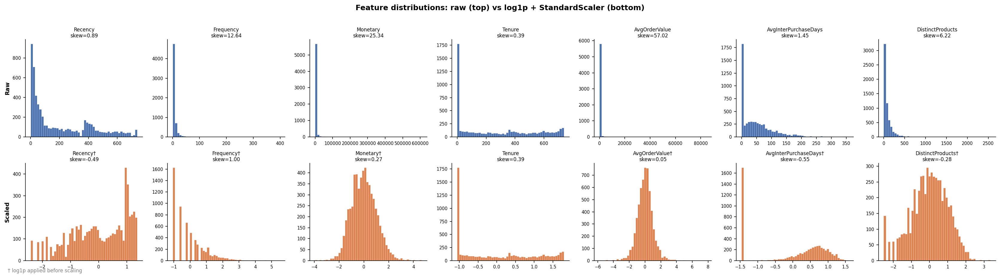


---

## Stage 3-4 — Clustering (4 algorithms)

K-Means (silhouette sweep), DBSCAN (k-distance knee for eps), Gaussian Mixture (BIC selection), and HDBSCAN.

<details>
<summary>📄 View code: <code>src/clustering.py</code> (590 lines)</summary>

```python
"""
Clustering module: K-Means, DBSCAN, GMM, and HDBSCAN on pre-scaled features.

Four algorithms are benchmarked so that the dissertation can argue for the
chosen solution on the basis of a systematic comparison rather than a single
arbitrary choice.  Each algorithm makes different assumptions about cluster
geometry and density, which is documented in its function docstring.

K-Means
    Assumes spherical, equally-sized clusters.  Chosen as the standard RFM
    baseline; interpretable centroids map directly to marketing personas.
    Tuned via elbow (inertia) + silhouette + Davies-Bouldin sweep over k=2..10.

DBSCAN
    Density-based; discovers arbitrary shapes; labels outliers as noise (-1).
    No k required, but sensitive to eps (neighbourhood radius).  eps is chosen
    objectively from the "knee" of the sorted k-distance graph (k = min_samples).

Gaussian Mixture Model (GMM)
    Probabilistic; assigns soft membership probabilities; allows elliptical
    clusters.  More flexible than K-Means for non-spherical RFM distributions.
    Number of components chosen by minimising BIC over n=2..10.

HDBSCAN
    Hierarchical density-based; handles variable-density clusters; labels
    low-density points as noise.  No parameters need tuning for small n.

PCA projection
--------------
All four label sets are visualised in a 2x2 PCA scatter grid (PC1/PC2).
The PCA is fitted once on the full scaled space and reused for all panels.
"""

from __future__ import annotations

import logging

import hdbscan as hdbscan_lib
import matplotlib
matplotlib.use("Agg")
import matplotlib.pyplot as plt
import numpy as np
import pandas as pd
from sklearn.cluster import DBSCAN, KMeans
from sklearn.decomposition import PCA
from sklearn.metrics import davies_bouldin_score, silhouette_score
from sklearn.mixture import GaussianMixture
from sklearn.neighbors import NearestNeighbors

from src.config import (
    CLUSTER_PARQUET,
    CUSTOMER_FEATURES_PARQUET,
    DATA_PROCESSED_DIR,
    DBSCAN_EPS,
    DBSCAN_MIN_SAMPLES,
    GMM_BEST_N,
    GMM_N_MAX,
    GMM_N_MIN,
    HDBSCAN_MIN_CLUSTER_SIZE,
    HDBSCAN_MIN_SAMPLES,
    KMEANS_BEST_K,
    KMEANS_K_MAX,
    KMEANS_K_MIN,
    OUTPUTS_FIGURES_DIR,
    OUTPUTS_TABLES_DIR,
    RANDOM_STATE,
    SCALED_FEATURES_PARQUET,
)
from src.preprocessing import FEATURE_COLS

logger = logging.getLogger(__name__)

KMEANS_METRICS_CSV   = OUTPUTS_TABLES_DIR / "kmeans_metrics.csv"
GMM_BIC_CSV          = OUTPUTS_TABLES_DIR / "gmm_bic.csv"
KMEANS_SELECTION_PNG = OUTPUTS_FIGURES_DIR / "kmeans_selection.png"
DBSCAN_KDIST_PNG     = OUTPUTS_FIGURES_DIR / "dbscan_kdistance.png"
GMM_BIC_PNG          = OUTPUTS_FIGURES_DIR / "gmm_bic.png"
CLUSTER_PCA_PNG      = OUTPUTS_FIGURES_DIR / "cluster_pca_projection.png"

_CLUSTER_PALETTE = [
    "#4C72B0", "#DD8452", "#55A868", "#C44E52", "#8172B3",
    "#937860", "#DA8BC3", "#8C8C8C", "#CCB974", "#64B5CD",
    "#E377C2", "#7F7F7F",
]
_NOISE_COLOUR = "#CCCCCC"


# ===========================================================================
# K-Means
# ===========================================================================

def _kmeans_sweep(X: np.ndarray) -> pd.DataFrame:
    """Fit K-Means for every k in [KMEANS_K_MIN, KMEANS_K_MAX] and record metrics.

    Three metrics collected per k:
    * inertia (WCSS) — elbow plot
    * silhouette — normalised inter/intra cluster ratio (higher = better)
    * davies_bouldin — scatter-to-separation ratio (lower = better)
    """
    rows: list[dict] = []
    logger.info("K-Means sweep: k = %d to %d", KMEANS_K_MIN, KMEANS_K_MAX)
    for k in range(KMEANS_K_MIN, KMEANS_K_MAX + 1):
        km = KMeans(n_clusters=k, init="k-means++", n_init=20,
                    random_state=RANDOM_STATE)
        labels = km.fit_predict(X)
        sil = silhouette_score(X, labels, sample_size=min(3000, len(X)),
                               random_state=RANDOM_STATE)
        db = davies_bouldin_score(X, labels)
        rows.append({"k": k, "inertia": round(km.inertia_, 2),
                     "silhouette": round(sil, 4), "davies_bouldin": round(db, 4)})
        logger.info("  k=%2d | inertia=%10.1f | silhouette=%.4f | DB=%.4f",
                    k, km.inertia_, sil, db)
    return pd.DataFrame(rows)


def _pick_best_k(metrics: pd.DataFrame) -> int:
    """Return k with highest silhouette, or the KMEANS_BEST_K config override."""
    if KMEANS_BEST_K is not None:
        logger.info("Using manually configured k = %d (KMEANS_BEST_K).", KMEANS_BEST_K)
        return KMEANS_BEST_K
    best = int(metrics.loc[metrics["silhouette"].idxmax(), "k"])
    logger.info("Auto-selected k = %d (silhouette = %.4f).", best,
                metrics["silhouette"].max())
    return best


def _plot_kmeans_selection(metrics: pd.DataFrame, best_k: int) -> None:
    """Three-panel figure: inertia (elbow), silhouette, Davies-Bouldin vs k."""
    fig, axes = plt.subplots(1, 3, figsize=(14, 4))
    fig.suptitle("K-Means model selection", fontsize=12, fontweight="bold", y=1.01)
    panels = [
        ("inertia",        "Inertia (WCSS)",      "steelblue",   False),
        ("silhouette",     "Silhouette score",     "darkorange",  True),
        ("davies_bouldin", "Davies-Bouldin index", "forestgreen", False),
    ]
    for ax, (col, ylabel, colour, higher) in zip(axes, panels):
        ax.plot(metrics["k"], metrics[col], marker="o", color=colour,
                linewidth=2, markersize=6)
        ax.axvline(best_k, color="red", linestyle="--", linewidth=1.5,
                   label=f"k={best_k} chosen")
        ax.set_xlabel("k", fontsize=10)
        ax.set_title(f"{ylabel}\n({'higher' if higher else 'lower'} = better)",
                     fontsize=10, fontweight="bold")
        ax.set_xticks(metrics["k"])
        ax.legend(fontsize=9)
        ax.spines[["top", "right"]].set_visible(False)
    plt.tight_layout()
    OUTPUTS_FIGURES_DIR.mkdir(parents=True, exist_ok=True)
    fig.savefig(KMEANS_SELECTION_PNG, dpi=150, bbox_inches="tight")
    plt.close(fig)
    logger.info("K-Means selection plot saved to %s", KMEANS_SELECTION_PNG)


def _fit_final_kmeans(X: np.ndarray, k: int) -> tuple[np.ndarray, KMeans]:
    """Fit final K-Means (n_init=50) and return (labels, fitted model)."""
    logger.info("Fitting final K-Means with k=%d (n_init=50).", k)
    km = KMeans(n_clusters=k, init="k-means++", n_init=50,
                random_state=RANDOM_STATE)
    labels = km.fit_predict(X)
    logger.info("Final K-Means silhouette = %.4f", silhouette_score(X, labels))
    return labels, km


# ===========================================================================
# DBSCAN
# ===========================================================================

def _find_knee(distances: np.ndarray) -> float:
    """Return the knee point of a sorted distance array using perpendicular distance.

    The knee is found geometrically: for each point on the sorted-distance
    curve, compute its perpendicular distance from the straight line connecting
    the first and last points.  The index with the maximum perpendicular
    distance is the knee — the point where the curve bends most sharply from
    flat (core region) to steep (outlier region).

    This is equivalent to the standard Kneedle algorithm (Satopaa et al., 2011)
    without requiring an external dependency.

    Parameters
    ----------
    distances:
        1-D array of sorted k-th-nearest-neighbour distances.
    """
    n = len(distances)
    x = np.linspace(0, 1, n)
    y = (distances - distances.min()) / (distances.max() - distances.min() + 1e-12)
    # Direction vector of the line from (x[0],y[0]) to (x[-1],y[-1])
    dx, dy = x[-1] - x[0], y[-1] - y[0]
    norm = np.sqrt(dx ** 2 + dy ** 2)
    # Perpendicular distances from each point to the line
    perp = np.abs(dx * (y - y[0]) - dy * (x - x[0])) / norm
    return float(distances[np.argmax(perp)])


def _kdistance_plot(X: np.ndarray, k: int, eps: float) -> None:
    """Save the sorted k-distance plot used to choose DBSCAN eps.

    The k-distance graph (Ester et al., 1996) plots, for each point, the
    distance to its k-th nearest neighbour, sorted in ascending order.  The
    point where the curve transitions sharply from flat to steep marks the
    natural neighbourhood radius (eps).  Points beyond this threshold are
    outliers; a cluster must contain at least ``min_samples`` core points
    within distance eps.

    Parameters
    ----------
    X:
        Scaled feature matrix.
    k:
        Neighbourhood size; set to ``DBSCAN_MIN_SAMPLES`` so the plot
        directly reflects the algorithm's core-point criterion.
    eps:
        Auto-detected knee value, marked with a horizontal red line.
    """
    nbrs = NearestNeighbors(n_neighbors=k).fit(X)
    dists, _ = nbrs.kneighbors(X)
    kd = np.sort(dists[:, -1])

    fig, ax = plt.subplots(figsize=(8, 4))
    ax.plot(kd, color="steelblue", linewidth=1.2)
    ax.axhline(eps, color="red", linestyle="--", linewidth=1.5,
               label=f"Knee / eps = {eps:.3f}")
    ax.set_xlabel("Points sorted by distance", fontsize=10)
    ax.set_ylabel(f"{k}-th nearest neighbour distance", fontsize=10)
    ax.set_title(f"DBSCAN k-distance plot  (k={k})\n"
                 f"Knee detection selects eps = {eps:.3f}",
                 fontsize=11, fontweight="bold")
    ax.legend(fontsize=9)
    ax.spines[["top", "right"]].set_visible(False)
    plt.tight_layout()
    OUTPUTS_FIGURES_DIR.mkdir(parents=True, exist_ok=True)
    fig.savefig(DBSCAN_KDIST_PNG, dpi=150, bbox_inches="tight")
    plt.close(fig)
    logger.info("DBSCAN k-distance plot saved to %s", DBSCAN_KDIST_PNG)


def _fit_dbscan(X: np.ndarray) -> tuple[np.ndarray, DBSCAN, float]:
    """Fit DBSCAN, auto-selecting eps from the k-distance knee if not configured.

    DBSCAN (Density-Based Spatial Clustering of Applications with Noise,
    Ester et al., 1996) groups points that are density-reachable within
    radius eps, requiring at least min_samples core points per cluster.

    Assumptions and suitability for RFM data
    -----------------------------------------
    * DBSCAN does not assume spherical clusters, making it appropriate for
      the irregular shapes that emerge in RFM space where one dimension
      (Monetary) is heavily right-skewed even after log-compression.
    * It automatically identifies noise points (label -1), which correspond
      to customers with unusual purchase behaviour that does not fit any
      coherent segment.
    * The main limitation is sensitivity to eps: a value too small produces
      many noise points; too large merges distinct segments.  The k-distance
      knee provides an objective, data-driven eps choice.

    Parameters
    ----------
    X:
        Scaled feature matrix.

    Returns
    -------
    tuple
        (labels, fitted DBSCAN, eps_used)
    """
    k = DBSCAN_MIN_SAMPLES
    if DBSCAN_EPS is not None:
        eps = DBSCAN_EPS
        logger.info("Using configured DBSCAN eps = %.4f.", eps)
    else:
        nbrs = NearestNeighbors(n_neighbors=k).fit(X)
        dists, _ = nbrs.kneighbors(X)
        kd = np.sort(dists[:, -1])
        eps = _find_knee(kd)
        logger.info("DBSCAN auto eps from k-distance knee = %.4f.", eps)

    _kdistance_plot(X, k, eps)

    db = DBSCAN(eps=eps, min_samples=DBSCAN_MIN_SAMPLES, metric="euclidean")
    labels = db.fit_predict(X)
    n_clusters = len(set(labels)) - (1 if -1 in labels else 0)
    n_noise = int((labels == -1).sum())
    logger.info("DBSCAN: %d clusters, %d noise points (%.1f%%), eps=%.4f.",
                n_clusters, n_noise, n_noise / len(labels) * 100, eps)
    return labels, db, eps


# ===========================================================================
# Gaussian Mixture Model
# ===========================================================================

def _gmm_bic_sweep(X: np.ndarray) -> pd.DataFrame:
    """Fit GMM for n=GMM_N_MIN..GMM_N_MAX and return BIC + AIC per component count.

    Gaussian Mixture Models (Dempster et al., 1977) represent the data as a
    weighted sum of multivariate Gaussian distributions.  Unlike K-Means, GMM:
    * allows elliptical cluster shapes via the full covariance matrix
    * assigns soft probabilities (posterior responsibilities) rather than hard
      labels, capturing uncertainty in borderline customers
    * is penalised for complexity via BIC/AIC, providing a principled criterion
      for choosing the number of components

    BIC (Bayesian Information Criterion) is preferred over AIC here because it
    applies a stronger penalty for model complexity, guarding against over-
    fitting the number of segments to the training sample.  The component count
    with the lowest BIC is selected automatically.

    Parameters
    ----------
    X:
        Scaled feature matrix.
    """
    rows = []
    logger.info("GMM BIC sweep: n = %d to %d", GMM_N_MIN, GMM_N_MAX)
    for n in range(GMM_N_MIN, GMM_N_MAX + 1):
        gmm = GaussianMixture(n_components=n, covariance_type="full",
                              random_state=RANDOM_STATE, n_init=5, max_iter=300)
        gmm.fit(X)
        rows.append({"n": n, "bic": round(gmm.bic(X), 2),
                     "aic": round(gmm.aic(X), 2)})
        logger.info("  n=%2d | BIC=%10.1f | AIC=%10.1f", n, gmm.bic(X), gmm.aic(X))
    return pd.DataFrame(rows)


def _pick_best_n(bic_df: pd.DataFrame) -> int:
    """Return n with lowest BIC, or GMM_BEST_N config override."""
    if GMM_BEST_N is not None:
        logger.info("Using manually configured GMM n = %d.", GMM_BEST_N)
        return GMM_BEST_N
    best = int(bic_df.loc[bic_df["bic"].idxmin(), "n"])
    logger.info("Auto-selected GMM n = %d (BIC = %.1f).", best,
                bic_df["bic"].min())
    return best


def _plot_gmm_bic(bic_df: pd.DataFrame, best_n: int) -> None:
    """Save BIC and AIC curves vs number of GMM components."""
    fig, ax = plt.subplots(figsize=(8, 4))
    ax.plot(bic_df["n"], bic_df["bic"], marker="o", color="steelblue",
            linewidth=2, label="BIC (used for selection)")
    ax.plot(bic_df["n"], bic_df["aic"], marker="s", color="darkorange",
            linewidth=2, linestyle="--", label="AIC")
    ax.axvline(best_n, color="red", linestyle="--", linewidth=1.5,
               label=f"n={best_n} chosen (min BIC)")
    ax.set_xlabel("Number of GMM components", fontsize=10)
    ax.set_ylabel("Information criterion (lower = better)", fontsize=10)
    ax.set_title("GMM model selection via BIC / AIC", fontsize=11,
                 fontweight="bold")
    ax.set_xticks(bic_df["n"])
    ax.legend(fontsize=9)
    ax.spines[["top", "right"]].set_visible(False)
    plt.tight_layout()
    OUTPUTS_FIGURES_DIR.mkdir(parents=True, exist_ok=True)
    fig.savefig(GMM_BIC_PNG, dpi=150, bbox_inches="tight")
    plt.close(fig)
    logger.info("GMM BIC plot saved to %s", GMM_BIC_PNG)


def _fit_final_gmm(X: np.ndarray, n: int) -> tuple[np.ndarray, GaussianMixture]:
    """Fit final GMM with chosen n and return (hard labels, fitted model).

    Hard labels are the argmax of the posterior responsibility matrix so that
    downstream profiling and validation work with integer segment IDs.  The
    full soft probabilities are available via ``model.predict_proba(X)``.
    """
    logger.info("Fitting final GMM with n=%d (n_init=10).", n)
    gmm = GaussianMixture(n_components=n, covariance_type="full",
                          random_state=RANDOM_STATE, n_init=10, max_iter=500)
    gmm.fit(X)
    labels = gmm.predict(X)
    sil = silhouette_score(X, labels, sample_size=min(3000, len(X)),
                           random_state=RANDOM_STATE)
    logger.info("Final GMM silhouette = %.4f.", sil)
    return labels, gmm


# ===========================================================================
# HDBSCAN
# ===========================================================================

def _fit_hdbscan(X: np.ndarray) -> tuple[np.ndarray, object]:
    """Fit HDBSCAN and return (labels, clusterer). Label -1 = noise.

    HDBSCAN (Campello et al., 2013) extends DBSCAN by building a cluster
    hierarchy and extracting stable flat clusters at the level of maximum
    persistence.  Key advantages over DBSCAN for RFM data:

    * No eps parameter — stability is assessed across all density thresholds.
    * Handles clusters of varying density, which is common in RFM space where
      high-value customers are sparse but form tight groups.
    * ``cluster_selection_method="eom"`` (Excess of Mass) produces fewer,
      more robust clusters than the leaf method.

    Noise points (-1) are retained; they typically correspond to customers
    with highly irregular purchase histories unsuitable for targeted campaigns.
    """
    logger.info("Fitting HDBSCAN (min_cluster_size=%d, min_samples=%d).",
                HDBSCAN_MIN_CLUSTER_SIZE, HDBSCAN_MIN_SAMPLES)
    clusterer = hdbscan_lib.HDBSCAN(
        min_cluster_size=HDBSCAN_MIN_CLUSTER_SIZE,
        min_samples=HDBSCAN_MIN_SAMPLES,
        metric="euclidean",
        cluster_selection_method="eom",
    )
    labels = clusterer.fit_predict(X)
    n_clusters = len(set(labels)) - (1 if -1 in labels else 0)
    n_noise = int((labels == -1).sum())
    logger.info("HDBSCAN: %d clusters, %d noise points (%.1f%%).",
                n_clusters, n_noise, n_noise / len(labels) * 100)
    return labels, clusterer


# ===========================================================================
# PCA visualisation (2x2 grid — all four algorithms)
# ===========================================================================

def _plot_pca_all(
    X: np.ndarray,
    all_labels: dict[str, np.ndarray],
) -> None:
    """Save a 2x2 PCA scatter grid showing all four algorithm partitions.

    One PCA is fitted on the full scaled space and shared across all panels,
    so differences between panels reflect genuine algorithmic variation rather
    than projection differences.  Explained variance is annotated on the axis
    labels.  Noise points (label -1) are drawn first in light grey so genuine
    cluster points render on top.

    Parameters
    ----------
    X:
        Scaled feature matrix.
    all_labels:
        Dict mapping algorithm name to integer label array.
    """
    pca = PCA(n_components=2, random_state=RANDOM_STATE)
    coords = pca.fit_transform(X)
    ev = pca.explained_variance_ratio_
    logger.info("PCA: PC1=%.1f%%, PC2=%.1f%% explained.", ev[0]*100, ev[1]*100)

    fig, axes = plt.subplots(2, 2, figsize=(14, 10))
    fig.suptitle(
        f"All-algorithm PCA projection\n"
        f"PC1 {ev[0]*100:.1f}% + PC2 {ev[1]*100:.1f}% = "
        f"{(ev[0]+ev[1])*100:.1f}% variance",
        fontsize=12, fontweight="bold",
    )

    for ax, (algo, labels) in zip(axes.flat, all_labels.items()):
        unique = sorted(np.unique(labels))
        n_real = len([c for c in unique if c != -1])
        ax.set_title(f"{algo}  ({n_real} clusters)", fontsize=11,
                     fontweight="bold")

        if -1 in unique:
            mask = labels == -1
            ax.scatter(coords[mask, 0], coords[mask, 1], c=_NOISE_COLOUR,
                       s=6, alpha=0.3, label=f"Noise (n={mask.sum():,})")

        cidx = 0
        for cid in unique:
            if cid == -1:
                continue
            mask = labels == cid
            colour = _CLUSTER_PALETTE[cidx % len(_CLUSTER_PALETTE)]
            ax.scatter(coords[mask, 0], coords[mask, 1], c=colour,
                       s=8, alpha=0.5, label=f"C{cid} (n={mask.sum():,})")
            cidx += 1

        ax.set_xlabel(f"PC1 ({ev[0]*100:.1f}%)", fontsize=9)
        ax.set_ylabel(f"PC2 ({ev[1]*100:.1f}%)", fontsize=9)
        ax.legend(fontsize=7, markerscale=2, framealpha=0.6)
        ax.spines[["top", "right"]].set_visible(False)

    plt.tight_layout()
    OUTPUTS_FIGURES_DIR.mkdir(parents=True, exist_ok=True)
    fig.savefig(CLUSTER_PCA_PNG, dpi=150, bbox_inches="tight")
    plt.close(fig)
    logger.info("PCA 2x2 projection saved to %s", CLUSTER_PCA_PNG)


# ===========================================================================
# Public API
# ===========================================================================

def run_all_clustering(X: np.ndarray | None = None) -> dict:
    """Run K-Means, DBSCAN, GMM, and HDBSCAN and save all results.

    Loads scaled features from ``data/processed/scaled_features.parquet`` if
    ``X`` is not supplied.  All four label arrays are merged with the raw
    customer features and saved to ``data/processed/clustered_customers.parquet``.

    Parameters
    ----------
    X:
        Optional pre-loaded scaled feature matrix.

    Returns
    -------
    dict
        Keys: ``"kmeans"``, ``"dbscan"``, ``"gmm"``, ``"hdbscan"``.
        Each value is a dict with ``"labels"`` (np.ndarray) and ``"model"``.
        Also includes ``"customer_ids"`` and ``"cluster_df"``.

    Side effects
    ------------
    * ``outputs/tables/kmeans_metrics.csv``
    * ``outputs/tables/gmm_bic.csv``
    * ``outputs/figures/kmeans_selection.png``
    * ``outputs/figures/dbscan_kdistance.png``
    * ``outputs/figures/gmm_bic.png``
    * ``outputs/figures/cluster_pca_projection.png``
    * ``data/processed/clustered_customers.parquet``
    """
    # ── Load data ──────────────────────────────────────────────────────────
    logger.info("Loading scaled features from %s", SCALED_FEATURES_PARQUET)
    scaled_df = pd.read_parquet(SCALED_FEATURES_PARQUET)
    customer_ids = scaled_df["Customer ID"].values
    if X is None:
        X = scaled_df[FEATURE_COLS].values
    logger.info("Clustering %d customers on %d features.", *X.shape)

    OUTPUTS_TABLES_DIR.mkdir(parents=True, exist_ok=True)

    # ── K-Means ────────────────────────────────────────────────────────────
    km_metrics = _kmeans_sweep(X)
    km_metrics.to_csv(KMEANS_METRICS_CSV, index=False)
    best_k = _pick_best_k(km_metrics)
    _plot_kmeans_selection(km_metrics, best_k)
    km_labels, km_model = _fit_final_kmeans(X, best_k)

    # ── DBSCAN ────────────────────────────────────────────────────────────
    db_labels, db_model, db_eps = _fit_dbscan(X)

    # ── GMM ───────────────────────────────────────────────────────────────
    bic_df = _gmm_bic_sweep(X)
    bic_df.to_csv(GMM_BIC_CSV, index=False)
    best_n = _pick_best_n(bic_df)
    _plot_gmm_bic(bic_df, best_n)
    gmm_labels, gmm_model = _fit_final_gmm(X, best_n)

    # ── HDBSCAN ───────────────────────────────────────────────────────────
    hdb_labels, hdb_model = _fit_hdbscan(X)

    # ── PCA (2x2) ─────────────────────────────────────────────────────────
    all_labels = {
        "K-Means":  km_labels,
        "DBSCAN":   db_labels,
        "GMM":      gmm_labels,
        "HDBSCAN":  hdb_labels,
    }
    _plot_pca_all(X, all_labels)

    # ── Persist cluster assignments ────────────────────────────────────────
    cluster_df = pd.DataFrame({
        "Customer ID":    customer_ids,
        "KMeans_Cluster": km_labels,
        "DBSCAN_Cluster": db_labels,
        "GMM_Cluster":    gmm_labels,
        "HDBSCAN_Cluster": hdb_labels,
    })
    features_df = pd.read_parquet(CUSTOMER_FEATURES_PARQUET)
    cluster_df = cluster_df.merge(features_df, on="Customer ID", how="left")
    DATA_PROCESSED_DIR.mkdir(parents=True, exist_ok=True)
    cluster_df.to_parquet(CLUSTER_PARQUET, index=False)
    logger.info("Cluster assignments saved to %s", CLUSTER_PARQUET)

    # ── Summary log ────────────────────────────────────────────────────────
    for algo, lbl in all_labels.items():
        sizes = pd.Series(lbl).value_counts().sort_index()
        parts = [f"C{c}:{n}" for c, n in sizes.items()]
        logger.info("%s: %s", algo, "  ".join(parts))

    return {
        "kmeans":       {"labels": km_labels,  "model": km_model},
        "dbscan":       {"labels": db_labels,  "model": db_model, "eps": db_eps},
        "gmm":          {"labels": gmm_labels, "model": gmm_model},
        "hdbscan":      {"labels": hdb_labels, "model": hdb_model},
        "customer_ids": customer_ids,
        "cluster_df":   cluster_df,
    }


# Backward-compatible alias kept so any cached imports still work.
def run_clustering(*args, **kwargs) -> pd.DataFrame:
    """Alias for run_all_clustering(); returns cluster_df for compatibility."""
    result = run_all_clustering(*args, **kwargs)
    return result["cluster_df"]

```

</details>

**Results:**

*Kmeans Metrics*

| k | inertia | silhouette | davies_bouldin |
| --- | --- | --- | --- |
| 2 | 23438.36 | 0.3708 | 1.0553 |
| 3 | 18041.47 | 0.3107 | 1.195 |
| 4 | 15848.35 | 0.2686 | 1.221 |
| 5 | 14174.16 | 0.2291 | 1.3871 |
| 6 | 12986.4 | 0.2379 | 1.3482 |
| 7 | 11987.54 | 0.2323 | 1.2849 |
| 8 | 11262.26 | 0.2284 | 1.3035 |
| 9 | 10569.34 | 0.2253 | 1.2927 |
| 10 | 10022.32 | 0.2257 | 1.2896 |


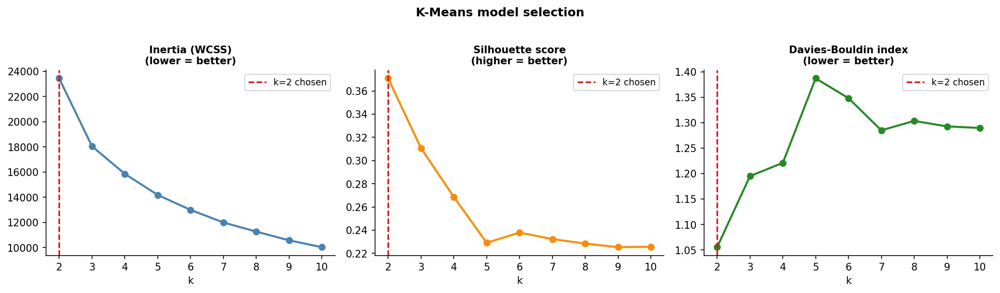


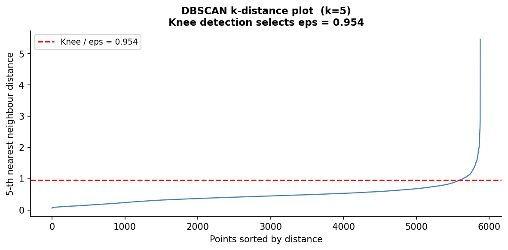


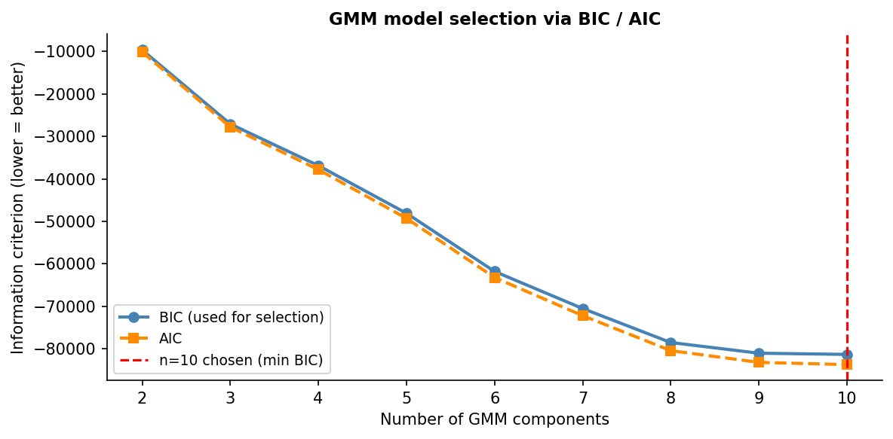


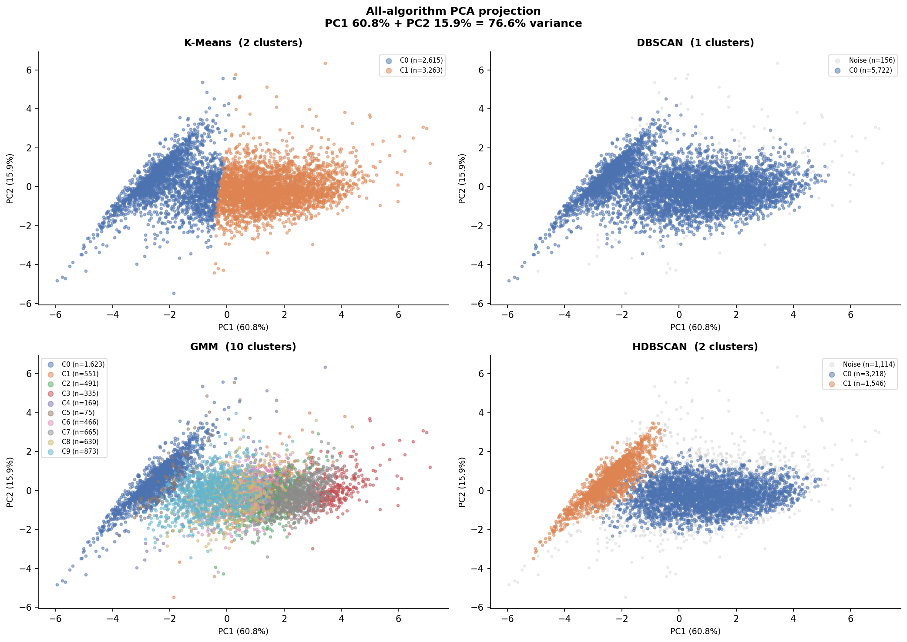


---

## Stage 3b — Validation & Stability

Internal metrics (Silhouette, Davies-Bouldin, Calinski-Harabasz) and bootstrap ARI stability across 50 resamples; the best algorithm is selected by a transparent rule (noise filter, ARI >= 0.70, then highest silhouette).

<details>
<summary>📄 View code: <code>src/validation.py</code> (641 lines)</summary>

```python
"""
Cluster validation and stability analysis.

Internal validity metrics
-------------------------
Three complementary internal metrics are computed for each algorithm.
They are called *internal* because they require only the data and labels —
no external ground truth — making them appropriate here where true customer
segments are unknown:

Silhouette Coefficient (Rousseeuw, 1987)
    For each point i, measures how similar it is to its own cluster (a)
    versus the nearest rival cluster (b): s(i) = (b-a) / max(a,b).
    The mean over all points lies in [-1, 1]; higher is better.
    It is the most intuitive metric and the most widely reported in the RFM
    segmentation literature, so it is used as the primary selection criterion.

Davies-Bouldin Index (Davies & Bouldin, 1979)
    Average ratio of within-cluster scatter to between-cluster distance.
    Lower is better; no absolute scale.  Tends to favour compact, well-
    separated clusters and is complementary to silhouette.

Calinski-Harabasz Index (Calinski & Harabasz, 1974)
    Ratio of between-cluster dispersion to within-cluster dispersion,
    scaled by cluster and sample counts.  Higher is better.  It rewards
    both tight clusters and large inter-cluster gaps, but tends to favour
    higher k because adding clusters always increases between-cluster
    variance.  Useful as a third independent vote.

HDBSCAN noise handling
----------------------
HDBSCAN labels points it cannot assign to any dense region as -1 (noise).
Including these in metric calculations would be misleading: sklearn treats
-1 as a valid cluster label, artificially inflating Davies-Bouldin (a
scattered noise "cluster" is far from its centroid) and deflating silhouette
(noise points are poorly separated from everything).  All three metrics for
HDBSCAN are therefore computed only on the subset of points with a genuine
cluster label (>= 0).  The noise fraction is reported separately.

Bootstrap stability analysis
----------------------------
A clustering solution is *stable* if it consistently recovers the same
partition when fitted on different random subsamples of the data.  Instability
signals that the cluster structure is an artefact of the particular sample
rather than a genuine feature of the population.

For each algorithm and each of ``N_BOOTSTRAP_ITERATIONS`` rounds:

1.  Draw a bootstrap sample (n_customers indices, *with* replacement) from
    the scaled feature matrix.
2.  Deduplicate the sample indices to obtain a unique subsample of roughly
    63.2% of customers on average (the expected fraction of distinct items in
    a bootstrap sample).
3.  Fit the algorithm on the subsample.
4.  For K-Means, predict labels for *all* customers (K-Means exposes a
    ``predict`` method, so out-of-sample assignment is trivial).  Compare
    the full predicted labels with the reference labels using ARI.
5.  For HDBSCAN, labels are available only for the unique subsample.
    Compare those subsample labels to the reference HDBSCAN labels at the
    same indices.  ARI treats -1 (noise) as just another label, so noise
    agreement contributes to — rather than inflating — the score.

Adjusted Rand Index (ARI) — Hubert & Arabie, 1985
    Measures pairwise label agreement between two partitions, corrected for
    chance.  Range: [-1, 1]; 1 = perfect agreement, 0 = random, negative =
    worse than random.  ARI is invariant to label permutations, so swapping
    "Cluster 0" and "Cluster 1" between runs does not penalise the score.

Best algorithm selection rule
------------------------------
:func:`select_best_algorithm` applies the following decision tree:

1.  Disqualify HDBSCAN if its noise fraction exceeds
    ``MAX_HDBSCAN_NOISE_FRACTION`` (default 30%).  A solution that cannot
    assign nearly a third of customers to any meaningful group is not useful
    for targeted marketing, regardless of its metric scores.
2.  Among the remaining candidates, retain only those with
    mean ARI >= ``ARI_STABILITY_THRESHOLD`` (default 0.70).  A solution that
    is not reproducible on fresh subsamples cannot be trusted, even if it
    scores well on a single run.
3.  Among stable candidates, return the one with the highest Silhouette
    Coefficient, as it is the most interpretable metric and the standard
    reported in the RFM literature.
4.  If no candidate is stable (rare with this dataset size), fall back to
    highest silhouette across all candidates and emit a warning.
"""

from __future__ import annotations

import logging
from typing import NamedTuple

import hdbscan as hdbscan_lib
import matplotlib
matplotlib.use("Agg")
import matplotlib.pyplot as plt
import numpy as np
import pandas as pd
from sklearn.cluster import DBSCAN, KMeans
from sklearn.mixture import GaussianMixture
from sklearn.metrics import (
    adjusted_rand_score,
    calinski_harabasz_score,
    davies_bouldin_score,
    silhouette_score,
)

from src.config import (
    ARI_STABILITY_THRESHOLD,
    CLUSTER_PARQUET,
    DBSCAN_EPS,
    DBSCAN_MIN_SAMPLES,
    GMM_BEST_N,
    HDBSCAN_MIN_CLUSTER_SIZE,
    HDBSCAN_MIN_SAMPLES,
    MAX_HDBSCAN_NOISE_FRACTION,
    N_BOOTSTRAP_ITERATIONS,
    OUTPUTS_FIGURES_DIR,
    OUTPUTS_TABLES_DIR,
    RANDOM_STATE,
    SCALED_FEATURES_PARQUET,
)
from src.preprocessing import FEATURE_COLS

logger = logging.getLogger(__name__)

VALIDATION_CSV = OUTPUTS_TABLES_DIR / "cluster_validation.csv"
STABILITY_PNG = OUTPUTS_FIGURES_DIR / "stability_ari.png"


class ValidationResult(NamedTuple):
    """Container returned by :func:`run_validation`.

    Attributes
    ----------
    metrics_df:
        Internal validity metrics table (one row per algorithm).
    stability_df:
        Per-algorithm ARI summary (mean, std, min, max).
    ari_scores:
        Raw ARI lists keyed by algorithm name, for custom analysis.
    best_algorithm:
        Name of the algorithm chosen by :func:`select_best_algorithm`.
    """
    metrics_df: pd.DataFrame
    stability_df: pd.DataFrame
    ari_scores: dict[str, list[float]]
    best_algorithm: str


# ---------------------------------------------------------------------------
# Internal validity metrics
# ---------------------------------------------------------------------------

def _compute_internal_metrics(
    X: np.ndarray,
    labels: np.ndarray,
    algorithm: str,
) -> dict:
    """Compute Silhouette, Davies-Bouldin, and Calinski-Harabasz for one set of labels.

    For HDBSCAN, noise points (label == -1) are excluded before metric
    calculation.  See module docstring for the full justification.

    Parameters
    ----------
    X:
        Scaled feature matrix, shape ``(n_customers, n_features)``.
    labels:
        Integer cluster labels; -1 is treated as noise and excluded.
    algorithm:
        Name string written into the output row.

    Returns
    -------
    dict
        Keys: Algorithm, n_clusters, noise_fraction, silhouette,
              davies_bouldin, calinski_harabasz.
    """
    is_noise = labels == -1
    noise_fraction = float(is_noise.mean())
    n_all = len(labels)

    # Restrict metrics to non-noise points.
    mask = ~is_noise
    X_valid = X[mask]
    labels_valid = labels[mask]

    n_clusters = len(np.unique(labels_valid))

    if n_clusters < 2 or len(X_valid) < n_clusters + 1:
        logger.warning("%s: not enough clusters/points for metrics.", algorithm)
        return {
            "Algorithm": algorithm,
            "n_clusters": n_clusters,
            "noise_fraction": round(noise_fraction, 4),
            "silhouette": float("nan"),
            "davies_bouldin": float("nan"),
            "calinski_harabasz": float("nan"),
        }

    sil = silhouette_score(X_valid, labels_valid,
                           sample_size=min(3000, len(X_valid)),
                           random_state=RANDOM_STATE)
    db = davies_bouldin_score(X_valid, labels_valid)
    ch = calinski_harabasz_score(X_valid, labels_valid)

    return {
        "Algorithm": algorithm,
        "n_clusters": n_clusters,
        "noise_fraction": round(noise_fraction, 4),
        "silhouette": round(sil, 4),
        "davies_bouldin": round(db, 4),
        "calinski_harabasz": round(ch, 2),
    }


def _build_metrics_table(
    X: np.ndarray,
    labels_dict: dict[str, np.ndarray],
) -> pd.DataFrame:
    """Assemble the internal validity comparison table for all algorithms.

    Parameters
    ----------
    X:
        Scaled feature matrix.
    labels_dict:
        Mapping of algorithm name to integer label array.  Algorithms with
        noise points (label == -1) have those points excluded from metrics.

    Returns
    -------
    pd.DataFrame
        One row per algorithm with silhouette, davies_bouldin,
        calinski_harabasz, n_clusters, and noise_fraction.
    """
    rows = [_compute_internal_metrics(X, lbl, algo)
            for algo, lbl in labels_dict.items()]
    df = pd.DataFrame(rows).set_index("Algorithm")
    logger.info("Validation metrics:\n%s", df.to_string())
    return df


# ---------------------------------------------------------------------------
# Bootstrap stability
# ---------------------------------------------------------------------------

def _one_bootstrap_round(
    X: np.ndarray,
    ref: np.ndarray,
    algo: str,
    params: dict,
    rng: np.random.Generator,
) -> float:
    """One bootstrap ARI round for any of the four supported algorithms.

    Algorithms that expose a ``predict`` method (K-Means, GMM) are fitted on
    the bootstrap subsample and then applied to the full dataset, so ARI is
    measured against all n_customers reference labels.

    Algorithms without ``predict`` (DBSCAN, HDBSCAN) are fitted on the unique
    bootstrap subsample and ARI is measured only on those in-sample indices.
    ARI treats -1 (noise) as a valid label, so noise agreement contributes to
    the score rather than inflating it.

    Parameters
    ----------
    X:
        Full scaled feature matrix.
    ref:
        Reference labels from the original fit.
    algo:
        One of ``"K-Means"``, ``"DBSCAN"``, ``"GMM"``, ``"HDBSCAN"``.
    params:
        Algorithm-specific hyper-parameters (e.g. k, n_components, eps).
    rng:
        Seeded numpy Generator for reproducibility.
    """
    idx = rng.choice(len(X), size=len(X), replace=True)
    uid = np.unique(idx)
    seed = int(rng.integers(1_000_000))

    if algo == "K-Means":
        k = params["k"]
        m = KMeans(n_clusters=k, init="k-means++", n_init=10, random_state=seed)
        m.fit(X[uid])
        return adjusted_rand_score(ref, m.predict(X))

    if algo == "GMM":
        n = params["n"]
        m = GaussianMixture(n_components=n, covariance_type="full",
                            random_state=seed, n_init=3, max_iter=200)
        m.fit(X[uid])
        return adjusted_rand_score(ref, m.predict(X))

    if algo == "DBSCAN":
        eps = params["eps"]
        m = DBSCAN(eps=eps, min_samples=DBSCAN_MIN_SAMPLES, metric="euclidean")
        boot_labels = m.fit_predict(X[uid])
        return adjusted_rand_score(ref[uid], boot_labels)

    if algo == "HDBSCAN":
        m = hdbscan_lib.HDBSCAN(
            min_cluster_size=HDBSCAN_MIN_CLUSTER_SIZE,
            min_samples=HDBSCAN_MIN_SAMPLES,
            metric="euclidean",
            cluster_selection_method="eom",
        )
        boot_labels = m.fit_predict(X[uid])
        return adjusted_rand_score(ref[uid], boot_labels)

    raise ValueError(f"Unknown algorithm: {algo}")


def _run_stability_analysis(
    X: np.ndarray,
    labels_dict: dict[str, np.ndarray],
    algo_params: dict[str, dict],
) -> dict[str, list[float]]:
    """Run N_BOOTSTRAP_ITERATIONS ARI rounds for every algorithm.

    Parameters
    ----------
    X:
        Scaled feature matrix.
    labels_dict:
        Reference labels keyed by algorithm name.
    algo_params:
        Hyper-parameters needed for refitting each algorithm in bootstrap
        rounds (e.g. ``{"K-Means": {"k": 2}, "GMM": {"n": 3}, ...}``).

    Returns
    -------
    dict
        ``{algo: [ari_0, …, ari_N]}`` for each algorithm.
    """
    rng = np.random.default_rng(RANDOM_STATE)
    ari_scores: dict[str, list[float]] = {a: [] for a in labels_dict}

    logger.info("Bootstrap stability: %d iterations, %d algorithms.",
                N_BOOTSTRAP_ITERATIONS, len(labels_dict))
    for i in range(N_BOOTSTRAP_ITERATIONS):
        for algo, ref in labels_dict.items():
            ari = _one_bootstrap_round(X, ref, algo,
                                       algo_params.get(algo, {}), rng)
            ari_scores[algo].append(ari)
        if (i + 1) % 10 == 0:
            summary = "  |  ".join(
                f"{a} ARI={np.mean(ari_scores[a]):.3f}"
                for a in labels_dict
            )
            logger.info("  Iter %2d/%d | %s", i + 1,
                        N_BOOTSTRAP_ITERATIONS, summary)

    return ari_scores


def _summarise_stability(ari_scores: dict[str, list[float]]) -> pd.DataFrame:
    """Convert raw ARI lists into a mean / std / min / max summary table."""
    rows = []
    for algo, scores in ari_scores.items():
        arr = np.array(scores)
        rows.append({
            "Algorithm": algo,
            "ARI_mean": round(arr.mean(), 4),
            "ARI_std": round(arr.std(), 4),
            "ARI_min": round(arr.min(), 4),
            "ARI_max": round(arr.max(), 4),
            "Stable": arr.mean() >= ARI_STABILITY_THRESHOLD,
        })
    df = pd.DataFrame(rows).set_index("Algorithm")
    logger.info("Stability summary:\n%s", df.to_string())
    return df


# ---------------------------------------------------------------------------
# Visualisation
# ---------------------------------------------------------------------------

def _plot_stability_boxplot(ari_scores: dict[str, list[float]]) -> None:
    """Save a boxplot comparing ARI distributions across algorithms.

    The horizontal dashed line marks ``ARI_STABILITY_THRESHOLD`` so the
    figure is self-documenting: algorithms whose boxes sit above the line are
    considered stable by the criterion used in :func:`select_best_algorithm`.

    Parameters
    ----------
    ari_scores:
        Raw ARI lists keyed by algorithm name.
    """
    fig, ax = plt.subplots(figsize=(7, 5))

    labels = list(ari_scores.keys())
    data = [ari_scores[k] for k in labels]
    _palette = ["#4C72B0", "#DD8452", "#55A868", "#C44E52"]
    colours = _palette[: len(labels)]

    bp = ax.boxplot(
        data,
        labels=labels,
        patch_artist=True,
        medianprops=dict(color="black", linewidth=2),
        whiskerprops=dict(linewidth=1.2),
        capprops=dict(linewidth=1.2),
        flierprops=dict(marker="o", markersize=4, alpha=0.5),
        widths=0.45,
    )
    for patch, colour in zip(bp["boxes"], colours):
        patch.set_facecolor(colour)
        patch.set_alpha(0.7)

    # Scatter jittered raw points for transparency.
    rng = np.random.default_rng(RANDOM_STATE)
    for i, scores in enumerate(data, start=1):
        jitter = rng.uniform(-0.08, 0.08, size=len(scores))
        ax.scatter(np.full(len(scores), i) + jitter, scores,
                   color=colours[i - 1], s=12, alpha=0.4, zorder=3)

    ax.axhline(ARI_STABILITY_THRESHOLD, color="red", linestyle="--",
               linewidth=1.4, label=f"Stability threshold (ARI={ARI_STABILITY_THRESHOLD})")

    ax.set_ylabel("Adjusted Rand Index (ARI)", fontsize=11)
    ax.set_title(
        f"Clustering stability — {N_BOOTSTRAP_ITERATIONS} bootstrap iterations\n"
        "(ARI vs reference partition; higher = more stable)",
        fontsize=11, fontweight="bold",
    )
    ax.set_ylim(-0.05, 1.05)
    ax.legend(fontsize=9)
    ax.spines[["top", "right"]].set_visible(False)

    # Annotate mean ARI on each box.
    for i, (algo, scores) in enumerate(ari_scores.items(), start=1):
        mean_ari = np.mean(scores)
        ax.text(i, mean_ari + 0.03, f"mean={mean_ari:.3f}",
                ha="center", va="bottom", fontsize=9, fontweight="bold")

    plt.tight_layout()
    OUTPUTS_FIGURES_DIR.mkdir(parents=True, exist_ok=True)
    fig.savefig(STABILITY_PNG, dpi=150, bbox_inches="tight")
    plt.close(fig)
    logger.info("Stability boxplot saved to %s", STABILITY_PNG)


# ---------------------------------------------------------------------------
# Algorithm selection
# ---------------------------------------------------------------------------

def select_best_algorithm(
    metrics_df: pd.DataFrame,
    stability_df: pd.DataFrame,
) -> str:
    """Choose the best clustering algorithm by a transparent, documented rule.

    Decision tree (applied in order; the first matching rule wins):

    1. **Noise disqualification** — if HDBSCAN's noise fraction exceeds
       ``MAX_HDBSCAN_NOISE_FRACTION`` (default 0.30), HDBSCAN is removed from
       consideration.  A solution that cannot assign ≥ 30% of customers to any
       cohesive group has limited marketing utility: those customers cannot be
       assigned to a campaign strategy.

    2. **Stability filter** — retain only algorithms whose mean bootstrap ARI
       is >= ``ARI_STABILITY_THRESHOLD`` (default 0.70).  An ARI below 0.70
       indicates that refitting on a random subsample produces a substantially
       different partition, meaning the labels are sensitive to the exact
       sample and should not be trusted as a stable segment definition.

    3. **Primary criterion: silhouette** — among the stable candidates, select
       the algorithm with the highest Silhouette Coefficient.  Silhouette is
       chosen as the primary metric because it is normalised (interpretable
       without a baseline), widely reported in the RFM literature, and measures
       the property that matters most for marketing: that customers within a
       segment are more similar to each other than to customers in other
       segments.

    4. **Fallback** — if no algorithm passes the stability filter (rare at
       n > 5 000), all candidates are reinstated and step 3 is applied with a
       logged warning so the researcher is alerted.

    Parameters
    ----------
    metrics_df:
        DataFrame produced by :func:`_build_metrics_table`, indexed by
        algorithm name.  Must contain a ``silhouette`` column and a
        ``noise_fraction`` column.
    stability_df:
        DataFrame produced by :func:`_summarise_stability`, indexed by
        algorithm name.  Must contain ``ARI_mean`` and ``Stable`` columns.

    Returns
    -------
    str
        Name of the selected algorithm (matches the index of ``metrics_df``).
    """
    combined = metrics_df.join(stability_df, how="inner")

    # Step 1: disqualify noisy HDBSCAN.
    too_noisy = combined["noise_fraction"] > MAX_HDBSCAN_NOISE_FRACTION
    if too_noisy.any():
        noisy_algos = combined.index[too_noisy].tolist()
        logger.warning(
            "Disqualifying %s: noise fraction exceeds %.0f%%.",
            noisy_algos, MAX_HDBSCAN_NOISE_FRACTION * 100,
        )
        combined = combined[~too_noisy]

    if combined.empty:
        logger.warning("All algorithms disqualified by noise criterion; "
                       "re-instating all candidates.")
        combined = metrics_df.join(stability_df, how="inner")

    # Step 2: stability filter.
    stable = combined[combined["Stable"]]
    if stable.empty:
        logger.warning(
            "No algorithm reached ARI stability threshold (%.2f). "
            "Falling back to highest silhouette across all candidates.",
            ARI_STABILITY_THRESHOLD,
        )
        stable = combined  # fallback: all candidates

    # Step 3: highest silhouette among stable candidates.
    best = stable["silhouette"].idxmax()
    best_sil = stable.loc[best, "silhouette"]
    best_ari = stable.loc[best, "ARI_mean"]
    logger.info(
        "Selected algorithm: %s  (silhouette=%.4f, mean ARI=%.4f).",
        best, best_sil, best_ari,
    )
    return str(best)


# ---------------------------------------------------------------------------
# Public API
# ---------------------------------------------------------------------------

def run_validation(
    X: np.ndarray | None = None,
    labels_dict: dict[str, np.ndarray] | None = None,
    algo_params: dict[str, dict] | None = None,
) -> ValidationResult:
    """Run the full validation and stability suite for all four algorithms.

    If ``labels_dict`` is ``None``, all four label columns are loaded from the
    cluster parquet produced by :func:`~src.clustering.run_all_clustering`.

    Parameters
    ----------
    X:
        Scaled feature matrix.  Pass ``None`` to load from
        ``data/processed/scaled_features.parquet``.
    labels_dict:
        Mapping ``{algorithm_name: label_array}``.  Pass ``None`` to load
        KMeans_Cluster, DBSCAN_Cluster, GMM_Cluster, and HDBSCAN_Cluster from
        ``data/processed/clustered_customers.parquet``.
    algo_params:
        Hyper-parameters for the bootstrap refitting step, e.g.::

            {
                "K-Means": {"k": 3},
                "GMM":     {"n": 4},
                "DBSCAN":  {"eps": 0.85},
            }

        HDBSCAN needs no extra params.  Pass ``None`` to infer k from the
        label array; ``eps`` falls back to ``DBSCAN_EPS`` if set.

    Returns
    -------
    ValidationResult
        Named tuple with fields ``metrics_df``, ``stability_df``,
        ``ari_scores``, and ``best_algorithm``.

    Side effects
    ------------
    * Writes ``outputs/tables/cluster_validation.csv``.
    * Writes ``outputs/figures/stability_ari.png``.
    """
    # ── Load scaled features ───────────────────────────────────────────────
    if X is None:
        logger.info("Loading scaled features from %s", SCALED_FEATURES_PARQUET)
        scaled_df = pd.read_parquet(SCALED_FEATURES_PARQUET)
        X = scaled_df[FEATURE_COLS].values

    # ── Load cluster labels ────────────────────────────────────────────────
    _col_map = {
        "K-Means": "KMeans_Cluster",
        "DBSCAN":  "DBSCAN_Cluster",
        "GMM":     "GMM_Cluster",
        "HDBSCAN": "HDBSCAN_Cluster",
    }
    if labels_dict is None:
        logger.info("Loading cluster labels from %s", CLUSTER_PARQUET)
        cluster_df = pd.read_parquet(CLUSTER_PARQUET)
        labels_dict = {}
        for algo, col in _col_map.items():
            if col in cluster_df.columns:
                labels_dict[algo] = cluster_df[col].values
            else:
                logger.warning("Column %s not found in cluster parquet; skipping %s.", col, algo)

    # ── Build algo_params if not supplied ──────────────────────────────────
    if algo_params is None:
        algo_params = {}
        if "K-Means" in labels_dict:
            algo_params["K-Means"] = {"k": int(len(np.unique(labels_dict["K-Means"])))}
        if "GMM" in labels_dict:
            algo_params["GMM"] = {"n": int(len(np.unique(labels_dict["GMM"])))}
        if "DBSCAN" in labels_dict:
            _eps = DBSCAN_EPS if DBSCAN_EPS is not None else 0.5
            algo_params["DBSCAN"] = {"eps": _eps}

    logger.info(
        "Validating %d customers across %d algorithms: %s",
        len(X), len(labels_dict), list(labels_dict.keys()),
    )

    # ── Internal validity metrics ──────────────────────────────────────────
    metrics_df = _build_metrics_table(X, labels_dict)
    OUTPUTS_TABLES_DIR.mkdir(parents=True, exist_ok=True)
    metrics_df.to_csv(VALIDATION_CSV)
    logger.info("Validation metrics saved to %s", VALIDATION_CSV)

    # ── Bootstrap stability ────────────────────────────────────────────────
    ari_scores = _run_stability_analysis(X, labels_dict, algo_params)
    stability_df = _summarise_stability(ari_scores)
    _plot_stability_boxplot(ari_scores)

    # ── Algorithm selection ────────────────────────────────────────────────
    best = select_best_algorithm(metrics_df, stability_df)

    return ValidationResult(
        metrics_df=metrics_df,
        stability_df=stability_df,
        ari_scores=ari_scores,
        best_algorithm=best,
    )

```

</details>

**Results:**

*Cluster Validation*

| Algorithm | n_clusters | noise_fraction | silhouette | davies_bouldin | calinski_harabasz |
| --- | --- | --- | --- | --- | --- |
| K-Means | 2 | 0.0 | 0.3708 | 1.0553 | 4439.31 |
| DBSCAN | 1 | 0.0265 |  |  |  |
| GMM | 10 | 0.0 | 0.0809 | 3.8093 | 989.57 |
| HDBSCAN | 2 | 0.1895 | 0.4157 | 0.89 | 4007.05 |


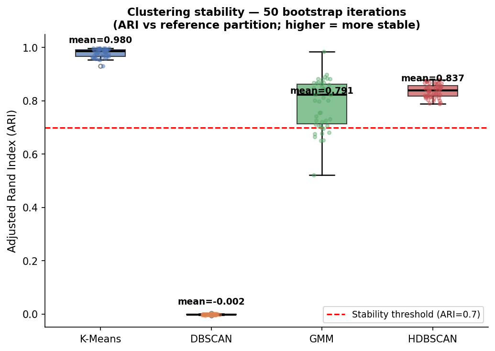


---

## Stage 6 — Segment Profiling

Per-segment un-scaled feature means with rule-based marketing names (Champions, Loyal, At-Risk, Lost, ...), shown as a heatmap and radar.

<details>
<summary>📄 View code: <code>src/profiling.py</code> (328 lines)</summary>

```python
"""
Phase 6: Cluster profiling and marketing segment naming.

For the best algorithm (default: HDBSCAN) and K-Means (for comparison),
computes per-segment un-scaled feature means, assigns a marketing-friendly
segment name via a rule-based decision tree, and produces a heatmap and a
radar/spider chart for the dissertation.

Outputs
-------
outputs/tables/segment_profiles.csv   -- mean features + name for each segment
outputs/figures/segment_profiles.png  -- heatmap (z-score coloured, raw values annotated)
outputs/figures/radar_profiles.png    -- radar chart (min-max normalised)
"""

from __future__ import annotations

import logging

import matplotlib
matplotlib.use("Agg")
import matplotlib.pyplot as plt
import numpy as np
import pandas as pd

from src.config import (
    CLUSTER_PARQUET,
    OUTPUTS_FIGURES_DIR,
    OUTPUTS_TABLES_DIR,
)

logger = logging.getLogger(__name__)

FEATURE_COLS: list[str] = [
    "Recency", "Frequency", "Monetary",
    "Tenure", "AvgOrderValue", "AvgInterPurchaseDays", "DistinctProducts",
]

# Canonical column names for each algorithm
_LABEL_COL: dict[str, str] = {
    "HDBSCAN":  "HDBSCAN_Cluster",
    "K-Means":  "KMeans_Cluster",
    "GMM":      "GMM_Cluster",
    "DBSCAN":   "DBSCAN_Cluster",
}

PROFILE_CSV = OUTPUTS_TABLES_DIR / "segment_profiles.csv"
HEATMAP_PNG = OUTPUTS_FIGURES_DIR / "segment_profiles.png"
RADAR_PNG   = OUTPUTS_FIGURES_DIR / "radar_profiles.png"


# ---------------------------------------------------------------------------
# Rule-based segment naming
# ---------------------------------------------------------------------------

def _assign_name(row: pd.Series, overall: pd.Series) -> str:
    """Map a cluster mean vector to a marketing segment name.

    Rules are applied in order; the first matching rule wins.

    Directional conventions (lower/higher = better):
    - Recency: lower = more recent purchase = better
    - Frequency, Monetary, AvgOrderValue, DistinctProducts: higher = better
    - AvgInterPurchaseDays: lower = buys more often = better

    All thresholds are expressed as multiples of the overall customer mean so
    no absolute monetary values are hard-coded.
    """
    r   = row["Recency"]
    f   = row["Frequency"]
    m   = row["Monetary"]

    or_ = overall["Recency"]
    of  = overall["Frequency"]
    om  = overall["Monetary"]

    if r < or_ * 0.55 and f > of * 1.5 and m > om * 1.5:
        return "Champions"
    if f > of * 1.2 and m > om * 1.2:
        return "Loyal Customers"
    if m > om * 2.0:
        return "Big Spenders"
    if r > or_ * 1.5 and f > of * 0.8:
        return "At Risk"
    if r > or_ * 1.6 and f < of * 0.8:
        return "Lost Customers"
    if r < or_ * 0.8 and f < of * 0.8:
        return "Potential Loyalists"
    return "General Customers"


def _name_clusters(
    profiles: pd.DataFrame,
    overall: pd.Series,
) -> dict[int, str]:
    """Return {cluster_id: segment_name} for every cluster label."""
    names: dict[int, str] = {}
    for cid, row in profiles.iterrows():
        if cid == -1:
            names[int(cid)] = "Noise / Uncategorised"
        else:
            names[int(cid)] = _assign_name(row, overall)
    return names


# ---------------------------------------------------------------------------
# Profile computation
# ---------------------------------------------------------------------------

def _build_profiles(
    cluster_df: pd.DataFrame,
    label_col: str,
) -> pd.DataFrame:
    """Compute per-cluster mean feature values (un-scaled, raw units).

    Parameters
    ----------
    cluster_df:
        DataFrame with raw feature columns and a cluster-label column.
    label_col:
        Name of the cluster label column (e.g. ``"HDBSCAN_Cluster"``).

    Returns
    -------
    pd.DataFrame
        Indexed by cluster label; columns are FEATURE_COLS plus ``size``
        and ``pct_of_total``.
    """
    grp = cluster_df.groupby(label_col)[FEATURE_COLS].mean()
    grp["size"] = cluster_df.groupby(label_col).size()
    grp["pct_of_total"] = (grp["size"] / len(cluster_df) * 100).round(2)
    return grp


# ---------------------------------------------------------------------------
# Visualisation
# ---------------------------------------------------------------------------

def _plot_heatmap(
    profiles: pd.DataFrame,
    names: dict[int, str],
    algo: str,
) -> None:
    """Save a z-score heatmap of cluster mean features.

    Colour encodes how far each cluster's mean deviates from the cross-cluster
    mean (red = below average, green = above average).  Raw values are
    annotated in each cell for exact readability.  Noise clusters are shown
    but excluded from the z-score normalisation reference.
    """
    feat_data = profiles[FEATURE_COLS].copy()
    non_noise = feat_data[feat_data.index != -1]
    ref_mean = non_noise.mean()
    ref_std  = non_noise.std() + 1e-9
    z = (feat_data - ref_mean) / ref_std

    row_labels = [
        f"C{cid}: {names.get(int(cid), str(cid))}\n(n={int(profiles.loc[cid,'size']):,},  "
        f"{profiles.loc[cid,'pct_of_total']:.1f}%)"
        for cid in profiles.index
    ]
    col_labels = [
        "Recency", "Frequency", "Monetary",
        "Tenure", "Avg\nOrder\nValue", "Avg Inter-\nPurchase\nDays", "Distinct\nProducts",
    ]

    nrows = len(row_labels)
    fig, ax = plt.subplots(figsize=(12, max(3.5, nrows * 1.6 + 2.0)))
    im = ax.imshow(z.values, cmap="RdYlGn", aspect="auto", vmin=-2.5, vmax=2.5)
    cbar = plt.colorbar(im, ax=ax, fraction=0.03, pad=0.02)
    cbar.set_label("Z-score vs cluster mean", fontsize=9)

    ax.set_xticks(range(len(col_labels)))
    ax.set_xticklabels(col_labels, fontsize=9)
    ax.set_yticks(range(nrows))
    ax.set_yticklabels(row_labels, fontsize=9)

    for ri, cid in enumerate(profiles.index):
        for ci, feat in enumerate(FEATURE_COLS):
            val = profiles.loc[cid, feat]
            fmt = f"{val:,.0f}" if abs(val) >= 100 else f"{val:.1f}"
            zval = float(z.loc[cid, feat])
            txt_colour = "white" if abs(zval) > 1.8 else "black"
            ax.text(ci, ri, fmt, ha="center", va="center",
                    fontsize=8.5, color=txt_colour, fontweight="bold")

    ax.set_title(
        f"Segment Profile Heatmap — {algo}\n"
        "(colour = z-score vs cluster means;  cell text = raw un-scaled mean)",
        fontsize=11, fontweight="bold",
    )
    plt.tight_layout()
    OUTPUTS_FIGURES_DIR.mkdir(parents=True, exist_ok=True)
    fig.savefig(HEATMAP_PNG, dpi=150, bbox_inches="tight")
    plt.close(fig)
    logger.info("Heatmap saved to %s", HEATMAP_PNG)


def _plot_radar(
    profiles: pd.DataFrame,
    names: dict[int, str],
    algo: str,
) -> None:
    """Save a radar/spider chart comparing non-noise cluster profiles.

    Features are min-max normalised across clusters so every axis shares the
    same [0, 1] scale.  Recency and AvgInterPurchaseDays are inverted before
    normalisation (lower = better becomes outward = better).
    """
    non_noise = profiles[profiles.index != -1].copy()
    if len(non_noise) < 2:
        logger.warning(
            "Only %d non-noise cluster(s) for %s; skipping radar chart.",
            len(non_noise), algo,
        )
        return

    feat_data = non_noise[FEATURE_COLS].copy()
    for col in ("Recency", "AvgInterPurchaseDays"):
        feat_data[col] = feat_data[col].max() - feat_data[col]

    mn, mx = feat_data.min(), feat_data.max()
    norm = (feat_data - mn) / (mx - mn + 1e-9)

    categories = [
        "Recency\n(inv)", "Frequency", "Monetary",
        "Tenure", "Avg\nOrder\nValue", "Inter-Purchase\n(inv)", "Distinct\nProducts",
    ]
    N = len(categories)
    angles = [n / N * 2 * np.pi for n in range(N)]
    angles_closed = angles + angles[:1]

    _palette = ["#4C72B0", "#DD8452", "#55A868", "#C44E52",
                "#8172B2", "#937860", "#DA8BC3"]

    fig, ax = plt.subplots(figsize=(8, 8), subplot_kw=dict(polar=True))

    for i, (cid, row) in enumerate(norm.iterrows()):
        values = row.tolist() + [row.iloc[0]]
        colour = _palette[i % len(_palette)]
        seg_name = names.get(int(cid), str(cid))
        n_cust = int(profiles.loc[cid, "size"])
        ax.plot(angles_closed, values, "o-", linewidth=2, color=colour,
                label=f"C{cid}: {seg_name} (n={n_cust:,})")
        ax.fill(angles_closed, values, alpha=0.15, color=colour)

    ax.set_xticks(angles)
    ax.set_xticklabels(categories, fontsize=9)
    ax.set_ylim(0, 1)
    ax.set_yticks([0.25, 0.5, 0.75, 1.0])
    ax.set_yticklabels(["25%", "50%", "75%", "100%"], fontsize=7, color="#888")
    ax.set_title(
        f"Cluster Radar Chart — {algo}\n(0-1 normalised; outward = better)",
        fontsize=11, fontweight="bold", pad=22,
    )
    ax.legend(loc="upper right", bbox_to_anchor=(1.45, 1.18), fontsize=9)
    ax.spines["polar"].set_visible(False)
    ax.grid(color="#ccc", linewidth=0.6)

    plt.tight_layout()
    fig.savefig(RADAR_PNG, dpi=150, bbox_inches="tight")
    plt.close(fig)
    logger.info("Radar chart saved to %s", RADAR_PNG)


# ---------------------------------------------------------------------------
# Public API
# ---------------------------------------------------------------------------

def profile_clusters(
    algo: str = "HDBSCAN",
    label_col: str | None = None,
) -> pd.DataFrame:
    """Build and save cluster profiles for the selected algorithm.

    Parameters
    ----------
    algo:
        Algorithm name — used for plot titles and as the CSV index label.
        Must be one of ``"HDBSCAN"``, ``"K-Means"``, ``"GMM"``, ``"DBSCAN"``.
    label_col:
        Override for the cluster label column name.  Inferred from ``algo``
        if ``None`` (e.g. ``"HDBSCAN"`` -> ``"HDBSCAN_Cluster"``).

    Returns
    -------
    pd.DataFrame
        Profile table: cluster means + size + pct_of_total + segment_name.
    """
    if label_col is None:
        label_col = _LABEL_COL.get(algo)
        if label_col is None:
            raise ValueError(
                f"Unknown algo '{algo}'. Pass label_col explicitly or use one of "
                f"{list(_LABEL_COL)}."
            )

    logger.info("Loading cluster data from %s", CLUSTER_PARQUET)
    cluster_df = pd.read_parquet(CLUSTER_PARQUET)

    if label_col not in cluster_df.columns:
        raise ValueError(
            f"Column '{label_col}' not found. Available: {list(cluster_df.columns)}"
        )

    profiles = _build_profiles(cluster_df, label_col)
    overall  = cluster_df[FEATURE_COLS].mean()
    names    = _name_clusters(profiles, overall)
    profiles["segment_name"] = [names[int(cid)] for cid in profiles.index]

    logger.info("Segment profiles (%s):", algo)
    for cid, row in profiles.iterrows():
        logger.info(
            "  C%s [%s] n=%d (%.1f%%) | R=%.0f F=%.1f M=%.0f",
            cid, row["segment_name"], int(row["size"]),
            row["pct_of_total"], row["Recency"],
            row["Frequency"], row["Monetary"],
        )

    OUTPUTS_TABLES_DIR.mkdir(parents=True, exist_ok=True)
    profiles.to_csv(PROFILE_CSV)
    logger.info("Segment profiles saved to %s", PROFILE_CSV)

    _plot_heatmap(profiles, names, algo)
    _plot_radar(profiles, names, algo)

    return profiles

```

</details>

**Results:**

*Segment Profiles*

| HDBSCAN_Cluster | Recency | Frequency | Monetary | Tenure | AvgOrderValue | AvgInterPurchaseDays | DistinctProducts | size | pct_of_total | segment_name |
| --- | --- | --- | --- | --- | --- | --- | --- | --- | --- | --- |
| -1 | 121.60861759425494 | 11.97576301615799 | 8467.28541292639 | 326.63824057450626 | 707.559837776136 | 55.42340633950029 | 115.85816876122082 | 1114 | 18.95 | Noise / Uncategorised |
| 0 | 151.35425730267247 | 6.86202610316967 | 2421.894965817278 | 385.62802983219393 | 324.7070412503192 | 72.42290816996415 | 99.8558110627719 | 3218 | 54.75 | General Customers |
| 1 | 362.8065976714101 | 1.0 | 297.05476714100905 | 0.0 | 297.05476714100905 | 0.0 | 20.384864165588617 | 1546 | 26.3 | Lost Customers |


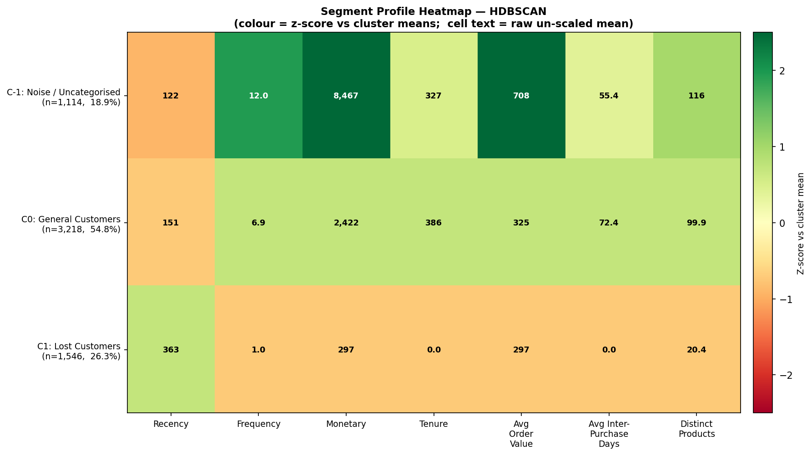


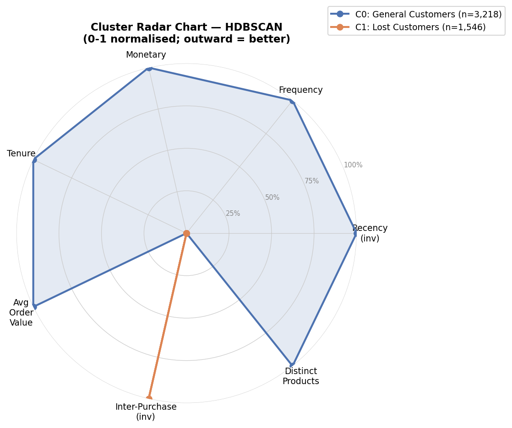


---

## Stage 7 — Customer Lifetime Value

BG/NBD (purchase process) + Gamma-Gamma (monetary process) to forecast discounted 12-month CLV and 90/180/365-day purchase counts.

<details>
<summary>📄 View code: <code>src/clv.py</code> (326 lines)</summary>

```python
"""
Phase 7: Customer Lifetime Value (CLV) via BG/NBD + Gamma-Gamma.

Two complementary probabilistic models from the ``lifetimes`` package are
combined to estimate forward-looking customer value:

BG/NBD (Beta-Geometric / Negative-Binomial Distribution)
    Models the *purchasing process*: how many transactions a customer is
    expected to make in a future window, and the probability they are still
    "alive" (have not silently churned).  Fitted on three RFM-style summary
    statistics per customer:
      - frequency: number of *repeat* purchases (total distinct purchase
        occasions minus one),
      - recency:   age of the customer at their last purchase (in the chosen
        time unit, here days),
      - T:         age of the customer (time between first purchase and the
        observation period end).

Gamma-Gamma
    Models the *monetary process*: the expected average transaction value per
    customer, conditioned on their observed average.  It assumes monetary
    value is independent of purchase frequency (verified by a low correlation
    check, logged as a diagnostic).  Fitted only on returning customers
    (frequency > 0) with positive monetary value.

The two are combined by :meth:`GammaGammaFitter.customer_lifetime_value`,
which discounts expected future cash flows (DCF) over a horizon of
``CLV_TIME_MONTHS`` months at ``CLV_DISCOUNT_RATE_MONTHLY``.

Outputs
-------
data/processed/customer_clv.parquet  -- per-customer CLV + forecast columns
outputs/tables/clv_summary.csv       -- describe() of the CLV columns
outputs/figures/clv_distribution.png -- CLV histogram + predicted-purchases plot
"""

from __future__ import annotations

import logging

import matplotlib
matplotlib.use("Agg")
import matplotlib.pyplot as plt
import numpy as np
import pandas as pd
from lifetimes import BetaGeoFitter, GammaGammaFitter
from lifetimes.utils import summary_data_from_transaction_data

from src.config import (
    BGMD_PENALIZER_COEF,
    CLEANED_PARQUET,
    CLV_DISCOUNT_RATE_MONTHLY,
    CLV_FORECAST_DAYS,
    CLV_TIME_MONTHS,
    CUSTOMER_CLV_PARQUET,
    CUSTOMER_FEATURES_PARQUET,
    GAMMA_GAMMA_PENALIZER_COEF,
    OUTPUTS_FIGURES_DIR,
    OUTPUTS_TABLES_DIR,
)

logger = logging.getLogger(__name__)

CLV_SUMMARY_CSV = OUTPUTS_TABLES_DIR / "clv_summary.csv"
CLV_DIST_PNG = OUTPUTS_FIGURES_DIR / "clv_distribution.png"


# ---------------------------------------------------------------------------
# RFM summary for the lifetimes models
# ---------------------------------------------------------------------------

def _build_clv_summary(transactions: pd.DataFrame) -> pd.DataFrame:
    """Aggregate transactions into the frequency/recency/T/monetary summary.

    Uses ``InvoiceDate`` as the timestamp and ``Customer ID`` as the customer
    key.  Multiple line items sharing an invoice on the same day count as a
    single purchase occasion (``freq="D"`` deduplicates within-day rows).

    Parameters
    ----------
    transactions:
        Cleaned transaction rows with ``Customer ID``, ``InvoiceDate``, and
        ``TotalPrice`` columns.

    Returns
    -------
    pd.DataFrame
        Indexed by Customer ID with columns ``frequency``, ``recency``, ``T``,
        and ``monetary_value`` (mean transaction value of repeat purchases).
    """
    obs_end = transactions["InvoiceDate"].max()
    logger.info("CLV observation period end: %s", obs_end)

    summary = summary_data_from_transaction_data(
        transactions,
        customer_id_col="Customer ID",
        datetime_col="InvoiceDate",
        monetary_value_col="TotalPrice",
        observation_period_end=obs_end,
        freq="D",
    )
    logger.info(
        "CLV summary built for %d customers (%.1f%% are repeat buyers).",
        len(summary), (summary["frequency"] > 0).mean() * 100,
    )
    return summary


# ---------------------------------------------------------------------------
# Model fitting
# ---------------------------------------------------------------------------

def _fit_bgnbd(summary: pd.DataFrame) -> BetaGeoFitter:
    """Fit the BG/NBD model on frequency, recency, and T."""
    bgf = BetaGeoFitter(penalizer_coef=BGMD_PENALIZER_COEF)
    bgf.fit(summary["frequency"], summary["recency"], summary["T"])
    logger.info("BG/NBD fitted. Params:\n%s", bgf.summary.to_string())
    return bgf


def _fit_gamma_gamma(returning: pd.DataFrame) -> GammaGammaFitter:
    """Fit the Gamma-Gamma model on returning customers' monetary values.

    Logs the frequency/monetary correlation as an independence diagnostic:
    the Gamma-Gamma model assumes these are uncorrelated, so a value near 0
    supports the model assumption.
    """
    corr = returning["frequency"].corr(returning["monetary_value"])
    logger.info(
        "Frequency/monetary correlation = %.4f (Gamma-Gamma assumes ~0).", corr,
    )
    ggf = GammaGammaFitter(penalizer_coef=GAMMA_GAMMA_PENALIZER_COEF)
    ggf.fit(returning["frequency"], returning["monetary_value"])
    logger.info("Gamma-Gamma fitted. Params:\n%s", ggf.summary.to_string())
    return ggf


# ---------------------------------------------------------------------------
# Prediction
# ---------------------------------------------------------------------------

def _predict_clv(
    summary: pd.DataFrame,
    bgf: BetaGeoFitter,
    ggf: GammaGammaFitter,
) -> pd.DataFrame:
    """Assemble per-customer CLV, expected value, and purchase forecasts.

    Returns a copy of ``summary`` augmented with:
      - ``prob_alive``           : P(customer still active)
      - ``pred_purchases_{d}d``  : expected purchase count over each horizon in
                                   ``CLV_FORECAST_DAYS``
      - ``exp_avg_value``        : Gamma-Gamma expected average transaction value
      - ``clv``                  : discounted CLV over ``CLV_TIME_MONTHS`` months
    """
    out = summary.copy()

    out["prob_alive"] = bgf.conditional_probability_alive(
        out["frequency"], out["recency"], out["T"],
    )

    for days in CLV_FORECAST_DAYS:
        out[f"pred_purchases_{days}d"] = bgf.conditional_expected_number_of_purchases_up_to_time(
            days, out["frequency"], out["recency"], out["T"],
        )

    # Gamma-Gamma expected value is only valid for returning customers.
    # When the fitted q parameter is < 1 (heavy-tailed monetary distribution),
    # the population baseline p*v/(q-1) is negative and contaminates one-time
    # buyers (frequency == 0, monetary == 0).  Conditional estimates for active
    # repeat customers remain valid; we clip the degenerate baseline at 0 so a
    # customer never carries a negative expected spend.
    q_param = float(ggf.params_["q"])
    if q_param <= 1:
        logger.warning(
            "Gamma-Gamma q=%.3f <= 1: population-baseline expected value is "
            "unreliable for non-returning customers; clipping at 0.", q_param,
        )
    out["exp_avg_value"] = ggf.conditional_expected_average_profit(
        out["frequency"], out["monetary_value"],
    ).clip(lower=0.0)

    # Discounted CLV over the configured horizon. customer_lifetime_value
    # expects the BG/NBD model plus the same summary inputs; monetary_value
    # must be positive, so non-returning / zero-value rows are clipped.
    safe_monetary = out["monetary_value"].clip(lower=0.0)
    out["clv"] = ggf.customer_lifetime_value(
        bgf,
        out["frequency"],
        out["recency"],
        out["T"],
        safe_monetary,
        time=CLV_TIME_MONTHS,
        freq="D",
        discount_rate=CLV_DISCOUNT_RATE_MONTHLY,
    )

    # CLV can be NaN for degenerate rows (zero monetary, zero frequency).
    out["clv"] = out["clv"].fillna(0.0).clip(lower=0.0)
    return out


# ---------------------------------------------------------------------------
# Visualisation
# ---------------------------------------------------------------------------

def _plot_clv(clv_df: pd.DataFrame) -> None:
    """Save a 2-panel figure: CLV distribution and 365-day purchase forecast."""
    fig, axes = plt.subplots(1, 2, figsize=(13, 5))

    # Panel 1: CLV distribution (clip the long tail at the 99th percentile
    # for readability; annotate how many customers fall beyond it).
    clv = clv_df["clv"]
    cap = clv.quantile(0.99)
    beyond = int((clv > cap).sum())
    axes[0].hist(clv.clip(upper=cap), bins=60, color="#4C72B0",
                 edgecolor="white", alpha=0.85)
    axes[0].axvline(clv.median(), color="#C44E52", linestyle="--",
                    linewidth=1.6, label=f"Median = {clv.median():,.0f}")
    axes[0].set_xlabel(f"Predicted {CLV_TIME_MONTHS}-month CLV (currency)", fontsize=10)
    axes[0].set_ylabel("Number of customers", fontsize=10)
    axes[0].set_title(
        f"CLV distribution\n(x-axis capped at 99th pct; {beyond:,} customers beyond)",
        fontsize=11, fontweight="bold",
    )
    axes[0].legend(fontsize=9)
    axes[0].spines[["top", "right"]].set_visible(False)

    # Panel 2: predicted 365-day purchases vs probability alive.
    longest = max(CLV_FORECAST_DAYS)
    col = f"pred_purchases_{longest}d"
    sc = axes[1].scatter(
        clv_df[col], clv_df["prob_alive"],
        c=clv_df["clv"].clip(upper=cap), cmap="viridis",
        s=14, alpha=0.6,
    )
    cbar = plt.colorbar(sc, ax=axes[1])
    cbar.set_label("CLV (capped)", fontsize=9)
    axes[1].set_xlabel(f"Expected purchases in next {longest} days", fontsize=10)
    axes[1].set_ylabel("P(customer still alive)", fontsize=10)
    axes[1].set_title("Engagement vs retention\n(colour = CLV)",
                      fontsize=11, fontweight="bold")
    axes[1].spines[["top", "right"]].set_visible(False)

    plt.tight_layout()
    OUTPUTS_FIGURES_DIR.mkdir(parents=True, exist_ok=True)
    fig.savefig(CLV_DIST_PNG, dpi=150, bbox_inches="tight")
    plt.close(fig)
    logger.info("CLV distribution plot saved to %s", CLV_DIST_PNG)


# ---------------------------------------------------------------------------
# Public API
# ---------------------------------------------------------------------------

def build_clv(
    transactions: pd.DataFrame | None = None,
    merge_features: bool = True,
) -> pd.DataFrame:
    """Fit BG/NBD + Gamma-Gamma and produce a per-customer CLV table.

    Parameters
    ----------
    transactions:
        Cleaned transaction rows.  Pass ``None`` to load from
        ``data/processed/cleaned_transactions.parquet``.
    merge_features:
        If ``True`` (default), left-merge the CLV columns onto the customer
        feature table so the result carries RFM + extended features + CLV.

    Returns
    -------
    pd.DataFrame
        Per-customer table including ``clv``, ``prob_alive``,
        ``exp_avg_value``, and ``pred_purchases_{d}d`` columns.  Saved to
        ``data/processed/customer_clv.parquet``.
    """
    if transactions is None:
        logger.info("Loading cleaned transactions from %s", CLEANED_PARQUET)
        transactions = pd.read_parquet(CLEANED_PARQUET)

    summary = _build_clv_summary(transactions)

    bgf = _fit_bgnbd(summary)
    returning = summary[summary["frequency"] > 0].copy()
    ggf = _fit_gamma_gamma(returning)

    clv_df = _predict_clv(summary, bgf, ggf)
    clv_df = clv_df.reset_index().rename(columns={"index": "Customer ID"})

    # Some lifetimes versions name the index column 'Customer ID' already.
    if "Customer ID" not in clv_df.columns and "CustomerID" in clv_df.columns:
        clv_df = clv_df.rename(columns={"CustomerID": "Customer ID"})

    if merge_features:
        logger.info("Loading customer features from %s", CUSTOMER_FEATURES_PARQUET)
        feats = pd.read_parquet(CUSTOMER_FEATURES_PARQUET)
        clv_df = feats.merge(clv_df, on="Customer ID", how="left", suffixes=("", "_clv"))

    # ── Persist ────────────────────────────────────────────────────────────
    CUSTOMER_CLV_PARQUET.parent.mkdir(parents=True, exist_ok=True)
    clv_df.to_parquet(CUSTOMER_CLV_PARQUET, index=False)
    logger.info("Customer CLV table (%d rows) saved to %s",
                len(clv_df), CUSTOMER_CLV_PARQUET)

    clv_cols = ["clv", "prob_alive", "exp_avg_value"] + \
               [f"pred_purchases_{d}d" for d in CLV_FORECAST_DAYS]
    summary_stats = clv_df[clv_cols].describe()
    OUTPUTS_TABLES_DIR.mkdir(parents=True, exist_ok=True)
    summary_stats.to_csv(CLV_SUMMARY_CSV)
    logger.info("CLV summary saved to %s\n%s", CLV_SUMMARY_CSV,
                summary_stats.to_string())

    _plot_clv(clv_df)

    # Headline figures for the dissertation narrative.
    total_clv = clv_df["clv"].sum()
    top_decile = clv_df["clv"].quantile(0.90)
    top_share = clv_df.loc[clv_df["clv"] >= top_decile, "clv"].sum() / total_clv * 100
    logger.info(
        "Total portfolio CLV = %s | top-decile customers hold %.1f%% of it.",
        f"{total_clv:,.0f}", top_share,
    )

    return clv_df

```

</details>

**Results:**

*Clv Summary*

|  | clv | prob_alive | exp_avg_value | pred_purchases_90d | pred_purchases_180d | pred_purchases_365d |
| --- | --- | --- | --- | --- | --- | --- |
| count | 5878.0 | 5878.0 | 5878.0 | 5878.0 | 5878.0 | 5878.0 |
| mean | 1417.6797908650135 | 0.9094565012121779 | 322.69602353478336 | 0.7980665936352721 | 1.5845063250488967 | 3.1746578089630204 |
| std | 7731.467964826514 | 0.17314063026740595 | 2279.4296987012153 | 1.2164237339969914 | 2.420189867586183 | 4.863441215068875 |
| min | 0.0 | 3.328687454013562e-10 | 0.0 | 1.3690297622403814e-09 | 2.7278035720444737e-09 | 5.492758327295621e-09 |
| 25% | 0.0 | 0.924008433482838 | 0.0 | 0.17409835577120195 | 0.34605528527934104 | 0.6938340522399855 |
| 50% | 370.6566005677035 | 0.979915905567136 | 217.84481299143349 | 0.45629294280937926 | 0.9050810860532509 | 1.8051370571252878 |
| 75% | 1223.8863856296516 | 1.0 | 380.1525753209821 | 0.973571250964685 | 1.9343814488698867 | 3.877407143067639 |
| max | 323792.48191292223 | 1.0 | 170205.5520020688 | 28.48502996197132 | 56.75872497360994 | 114.29754976043145 |


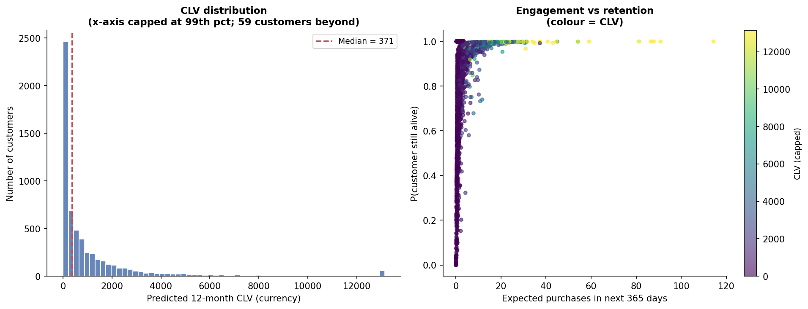


---

## Stage 8 — Churn Classification

Logistic Regression / Random Forest / XGBoost compared by ROC-AUC. Recency is excluded from the features to avoid target leakage (churn is defined from Recency).

<details>
<summary>📄 View code: <code>src/churn.py</code> (331 lines)</summary>

```python
"""
Phase 8: Churn classification (Logistic Regression vs Random Forest vs XGBoost).

Churn definition
----------------
A customer is labelled *churned* (y = 1) if their Recency exceeds the
``CHURN_RECENCY_PERCENTILE`` (default 90th) percentile of the customer base —
i.e. they are among the most dormant customers, having gone the longest
without a purchase.  This yields an intentionally imbalanced target
(~10% positive), which is handled with class weighting rather than resampling.

Target-leakage avoidance
-------------------------
Because the label is *derived from Recency*, Recency itself is excluded from
the feature set.  Including it would let any model trivially recover the
percentile threshold and report a meaningless ~1.0 ROC-AUC.  The models must
instead predict dormancy from behavioural signals that are *not* mechanically
tied to the label: Frequency, Monetary, Tenure, AvgOrderValue,
AvgInterPurchaseDays, and DistinctProducts.

Models compared
---------------
- Logistic Regression  (linear baseline, class_weight="balanced")
- Random Forest        (bagged trees, class_weight="balanced")
- XGBoost              (gradient-boosted trees, scale_pos_weight for imbalance)

All three are evaluated on a held-out stratified test split and via stratified
cross-validation, ranked primarily by ROC-AUC (threshold-independent and
robust to class imbalance).  The best model produces a churn probability for
every customer.

Outputs
-------
data/processed/customer_churn.parquet      -- Customer ID, churn_label, churn_probability
outputs/tables/churn_model_comparison.csv  -- per-model metrics
outputs/figures/churn_roc_curves.png       -- ROC curves for all three models
outputs/figures/churn_feature_importance.png -- importance from the best tree model
"""

from __future__ import annotations

import logging

import matplotlib
matplotlib.use("Agg")
import matplotlib.pyplot as plt
import numpy as np
import pandas as pd
from sklearn.ensemble import RandomForestClassifier
from sklearn.linear_model import LogisticRegression
from sklearn.metrics import (
    average_precision_score,
    f1_score,
    precision_score,
    recall_score,
    roc_auc_score,
    roc_curve,
)
from sklearn.model_selection import StratifiedKFold, cross_val_score, train_test_split
from sklearn.preprocessing import StandardScaler
from xgboost import XGBClassifier

from src.config import (
    CHURN_CV_FOLDS,
    CHURN_RECENCY_PERCENTILE,
    CUSTOMER_CHURN_PARQUET,
    CUSTOMER_FEATURES_PARQUET,
    OUTPUTS_FIGURES_DIR,
    OUTPUTS_TABLES_DIR,
    RANDOM_STATE,
    TEST_SIZE,
    XGB_COLSAMPLE_BYTREE,
    XGB_LEARNING_RATE,
    XGB_MAX_DEPTH,
    XGB_N_ESTIMATORS,
    XGB_SUBSAMPLE,
)

logger = logging.getLogger(__name__)

# Behavioural features used to predict churn. Recency is deliberately omitted
# (see module docstring: it defines the label, so including it would leak).
CHURN_FEATURES: list[str] = [
    "Frequency", "Monetary", "Tenure",
    "AvgOrderValue", "AvgInterPurchaseDays", "DistinctProducts",
]

COMPARISON_CSV = OUTPUTS_TABLES_DIR / "churn_model_comparison.csv"
ROC_PNG = OUTPUTS_FIGURES_DIR / "churn_roc_curves.png"
IMPORTANCE_PNG = OUTPUTS_FIGURES_DIR / "churn_feature_importance.png"


# ---------------------------------------------------------------------------
# Label construction
# ---------------------------------------------------------------------------

def _build_label(features: pd.DataFrame) -> pd.Series:
    """Return the binary churn label from the Recency percentile threshold."""
    threshold = features["Recency"].quantile(CHURN_RECENCY_PERCENTILE)
    y = (features["Recency"] > threshold).astype(int)
    logger.info(
        "Churn label: Recency > %.0f days (P%.0f) -> %d churned / %d total (%.1f%%).",
        threshold, CHURN_RECENCY_PERCENTILE * 100, int(y.sum()), len(y),
        y.mean() * 100,
    )
    return y


# ---------------------------------------------------------------------------
# Model construction
# ---------------------------------------------------------------------------

def _build_models(pos_weight: float) -> dict[str, object]:
    """Instantiate the three classifiers with imbalance handling.

    Parameters
    ----------
    pos_weight:
        Ratio of negative to positive samples, used as ``scale_pos_weight``
        for XGBoost.  Logistic Regression and Random Forest instead use
        ``class_weight="balanced"``.
    """
    return {
        "LogisticRegression": LogisticRegression(
            class_weight="balanced", max_iter=1000, random_state=RANDOM_STATE,
        ),
        "RandomForest": RandomForestClassifier(
            n_estimators=300, max_depth=8, class_weight="balanced",
            n_jobs=-1, random_state=RANDOM_STATE,
        ),
        "XGBoost": XGBClassifier(
            n_estimators=XGB_N_ESTIMATORS, max_depth=XGB_MAX_DEPTH,
            learning_rate=XGB_LEARNING_RATE, subsample=XGB_SUBSAMPLE,
            colsample_bytree=XGB_COLSAMPLE_BYTREE, scale_pos_weight=pos_weight,
            eval_metric="logloss", random_state=RANDOM_STATE, n_jobs=-1,
        ),
    }


# ---------------------------------------------------------------------------
# Training & evaluation
# ---------------------------------------------------------------------------

def _evaluate(
    models: dict[str, object],
    X_train: np.ndarray,
    X_test: np.ndarray,
    y_train: pd.Series,
    y_test: pd.Series,
) -> tuple[pd.DataFrame, dict[str, np.ndarray], dict[str, object]]:
    """Fit each model and compute held-out + cross-validated metrics.

    Returns
    -------
    (metrics_df, roc_data, fitted)
        ``metrics_df``: one row per model (ROC-AUC, PR-AUC, precision, recall,
        F1, CV ROC-AUC mean/std).
        ``roc_data``: {model_name: (fpr, tpr)} for the ROC plot.
        ``fitted``: {model_name: fitted_estimator}.
    """
    cv = StratifiedKFold(n_splits=CHURN_CV_FOLDS, shuffle=True,
                         random_state=RANDOM_STATE)
    rows = []
    roc_data: dict[str, np.ndarray] = {}
    fitted: dict[str, object] = {}

    for name, model in models.items():
        model.fit(X_train, y_train)
        fitted[name] = model

        proba = model.predict_proba(X_test)[:, 1]
        pred = (proba >= 0.5).astype(int)

        roc_auc = roc_auc_score(y_test, proba)
        pr_auc = average_precision_score(y_test, proba)
        prec = precision_score(y_test, pred, zero_division=0)
        rec = recall_score(y_test, pred, zero_division=0)
        f1 = f1_score(y_test, pred, zero_division=0)

        cv_scores = cross_val_score(model, X_train, y_train, cv=cv,
                                    scoring="roc_auc", n_jobs=-1)

        fpr, tpr, _ = roc_curve(y_test, proba)
        roc_data[name] = (fpr, tpr)

        rows.append({
            "Model": name,
            "ROC_AUC": round(roc_auc, 4),
            "PR_AUC": round(pr_auc, 4),
            "Precision": round(prec, 4),
            "Recall": round(rec, 4),
            "F1": round(f1, 4),
            "CV_ROC_AUC_mean": round(cv_scores.mean(), 4),
            "CV_ROC_AUC_std": round(cv_scores.std(), 4),
        })
        logger.info(
            "%s: ROC-AUC=%.4f PR-AUC=%.4f F1=%.4f CV-AUC=%.4f+/-%.4f",
            name, roc_auc, pr_auc, f1, cv_scores.mean(), cv_scores.std(),
        )

    metrics_df = pd.DataFrame(rows).set_index("Model")
    return metrics_df, roc_data, fitted


# ---------------------------------------------------------------------------
# Visualisation
# ---------------------------------------------------------------------------

def _plot_roc(roc_data: dict[str, np.ndarray], metrics_df: pd.DataFrame) -> None:
    """Save overlaid ROC curves for all models with AUC in the legend."""
    fig, ax = plt.subplots(figsize=(7, 6))
    palette = {"LogisticRegression": "#4C72B0", "RandomForest": "#55A868",
               "XGBoost": "#C44E52"}
    for name, (fpr, tpr) in roc_data.items():
        auc = metrics_df.loc[name, "ROC_AUC"]
        ax.plot(fpr, tpr, linewidth=2, color=palette.get(name, "#333"),
                label=f"{name} (AUC = {auc:.3f})")
    ax.plot([0, 1], [0, 1], "--", color="#999", linewidth=1.2, label="Chance")
    ax.set_xlabel("False Positive Rate", fontsize=10)
    ax.set_ylabel("True Positive Rate", fontsize=10)
    ax.set_title("Churn model ROC curves\n(held-out test set)",
                 fontsize=11, fontweight="bold")
    ax.legend(fontsize=9, loc="lower right")
    ax.spines[["top", "right"]].set_visible(False)
    plt.tight_layout()
    OUTPUTS_FIGURES_DIR.mkdir(parents=True, exist_ok=True)
    fig.savefig(ROC_PNG, dpi=150, bbox_inches="tight")
    plt.close(fig)
    logger.info("ROC curves saved to %s", ROC_PNG)


def _plot_importance(model: object, model_name: str) -> None:
    """Save a feature-importance bar chart from a fitted tree model."""
    if not hasattr(model, "feature_importances_"):
        logger.info("%s has no feature_importances_; skipping importance plot.",
                    model_name)
        return
    importances = pd.Series(model.feature_importances_, index=CHURN_FEATURES)
    importances = importances.sort_values()

    fig, ax = plt.subplots(figsize=(8, 4.5))
    ax.barh(importances.index, importances.values, color="#55A868", alpha=0.85)
    ax.set_xlabel("Feature importance", fontsize=10)
    ax.set_title(f"Churn drivers — {model_name} feature importance",
                 fontsize=11, fontweight="bold")
    for i, v in enumerate(importances.values):
        ax.text(v, i, f" {v:.3f}", va="center", fontsize=8.5)
    ax.spines[["top", "right"]].set_visible(False)
    plt.tight_layout()
    fig.savefig(IMPORTANCE_PNG, dpi=150, bbox_inches="tight")
    plt.close(fig)
    logger.info("Feature importance plot saved to %s", IMPORTANCE_PNG)


# ---------------------------------------------------------------------------
# Public API
# ---------------------------------------------------------------------------

def run_churn(features: pd.DataFrame | None = None) -> pd.DataFrame:
    """Train and compare churn models; score every customer with the best one.

    Parameters
    ----------
    features:
        Customer feature table.  Pass ``None`` to load from
        ``data/processed/customer_features.parquet``.

    Returns
    -------
    pd.DataFrame
        Per-customer table: ``Customer ID``, ``churn_label``,
        ``churn_probability`` (from the best model).  Saved to
        ``data/processed/customer_churn.parquet``.
    """
    if features is None:
        logger.info("Loading customer features from %s", CUSTOMER_FEATURES_PARQUET)
        features = pd.read_parquet(CUSTOMER_FEATURES_PARQUET)

    y = _build_label(features)
    X = features[CHURN_FEATURES].values

    # Standardise features: required for Logistic Regression, harmless for trees.
    scaler = StandardScaler()
    X_scaled = scaler.fit_transform(X)

    X_train, X_test, y_train, y_test = train_test_split(
        X_scaled, y, test_size=TEST_SIZE, stratify=y, random_state=RANDOM_STATE,
    )
    logger.info("Train/test split: %d train, %d test (stratified).",
                len(X_train), len(X_test))

    pos_weight = float((y_train == 0).sum() / max((y_train == 1).sum(), 1))
    models = _build_models(pos_weight)

    metrics_df, roc_data, fitted = _evaluate(
        models, X_train, X_test, y_train, y_test,
    )

    OUTPUTS_TABLES_DIR.mkdir(parents=True, exist_ok=True)
    metrics_df.to_csv(COMPARISON_CSV)
    logger.info("Model comparison saved to %s\n%s",
                COMPARISON_CSV, metrics_df.to_string())

    # Best model by held-out ROC-AUC.
    best_name = metrics_df["ROC_AUC"].idxmax()
    best_model = fitted[best_name]
    logger.info("Best churn model: %s (ROC-AUC=%.4f).",
                best_name, metrics_df.loc[best_name, "ROC_AUC"])

    _plot_roc(roc_data, metrics_df)
    # Prefer a tree model for the importance plot if the best is linear.
    imp_name = best_name if hasattr(best_model, "feature_importances_") else "RandomForest"
    _plot_importance(fitted[imp_name], imp_name)

    # Score every customer with the best model (re-fit on all data so the
    # probabilities use the full sample, not just the training split).
    best_model.fit(X_scaled, y)
    churn_prob = best_model.predict_proba(X_scaled)[:, 1]

    out = pd.DataFrame({
        "Customer ID": features["Customer ID"].values,
        "churn_label": y.values,
        "churn_probability": churn_prob,
    })
    CUSTOMER_CHURN_PARQUET.parent.mkdir(parents=True, exist_ok=True)
    out.to_parquet(CUSTOMER_CHURN_PARQUET, index=False)
    logger.info("Customer churn scores (%d rows) saved to %s",
                len(out), CUSTOMER_CHURN_PARQUET)

    return out

```

</details>

**Results:**

*Churn Model Comparison*

| Model | ROC_AUC | PR_AUC | Precision | Recall | F1 | CV_ROC_AUC_mean | CV_ROC_AUC_std |
| --- | --- | --- | --- | --- | --- | --- | --- |
| LogisticRegression | 0.8459 | 0.2795 | 0.2296 | 0.8889 | 0.3649 | 0.8459 | 0.0131 |
| RandomForest | 0.849 | 0.2874 | 0.2708 | 0.7521 | 0.3982 | 0.8424 | 0.0108 |
| XGBoost | 0.8469 | 0.2972 | 0.2663 | 0.735 | 0.3909 | 0.8398 | 0.0074 |


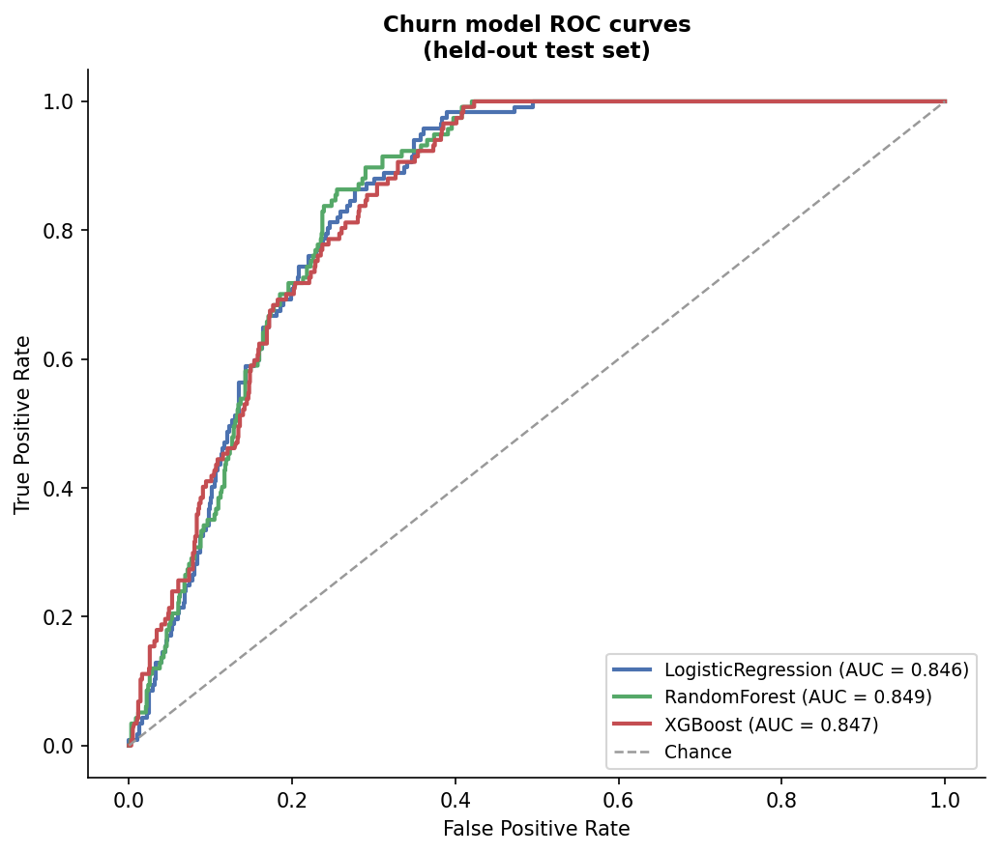


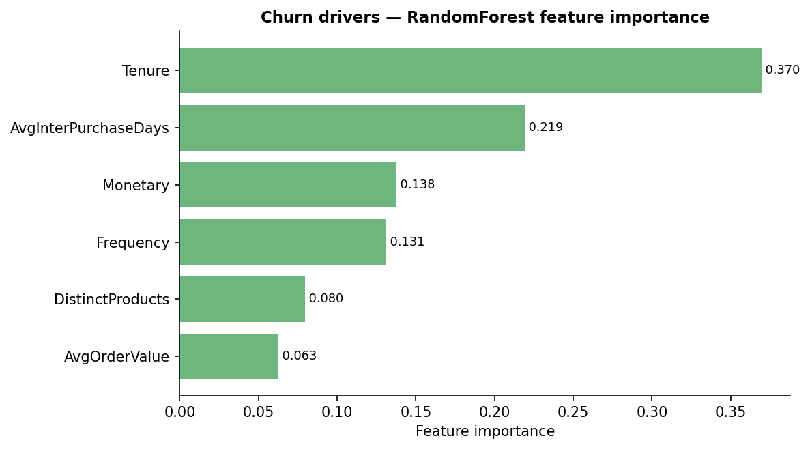


---

## Stage 9 — Segment Migration

Year-on-year segment transition matrix over customers present in both years, with retained / lapsed / new cohort sizes.

<details>
<summary>📄 View code: <code>src/migration.py</code> (243 lines)</summary>

```python
"""
Phase 9: Year-on-year segment migration analysis.

The dataset spans two retail years ("2009-2010" and "2010-2011").  This module
segments each customer *independently within each year* using the same
rule-based RFM naming applied in :mod:`src.profiling`, then builds a transition
matrix describing how customers move between segments from one year to the next.

Why per-year rule-based segments (not the global clusters)?
-----------------------------------------------------------
The global clustering (Stage 3) was fitted on the full two-year window, so it
assigns each customer a single label and cannot express *movement*.  To measure
migration we need a comparable segment definition that can be recomputed on each
year's transactions.  The rule-based RFM namer is deterministic and
year-agnostic — "Champions" means the same thing in both years — so its labels
are directly comparable across time, which cluster IDs are not.

Each year's Recency is measured relative to that year's own snapshot date
(max InvoiceDate within the year + offset), so a customer active late in
2009-2010 is not penalised by the gap to the 2010-2011 window.

Outputs
-------
outputs/tables/segment_migration_counts.csv  -- raw transition counts
outputs/tables/segment_migration_rates.csv   -- row-normalised probabilities
outputs/figures/segment_migration.png        -- annotated heatmap
"""

from __future__ import annotations

import logging

import matplotlib
matplotlib.use("Agg")
import matplotlib.pyplot as plt
import numpy as np
import pandas as pd

from src.config import (
    CLEANED_PARQUET,
    OUTPUTS_FIGURES_DIR,
    OUTPUTS_TABLES_DIR,
    RFM_SNAPSHOT_DATE_OFFSET_DAYS,
)
from src.features import _build_extended, _build_rfm
from src.profiling import _assign_name

logger = logging.getLogger(__name__)

MIGRATION_COUNTS_CSV = OUTPUTS_TABLES_DIR / "segment_migration_counts.csv"
MIGRATION_RATES_CSV = OUTPUTS_TABLES_DIR / "segment_migration_rates.csv"
MIGRATION_PNG = OUTPUTS_FIGURES_DIR / "segment_migration.png"

# Canonical ordering from most to least valuable, so the matrix diagonal reads
# top-left (best) to bottom-right (worst) and up/down-grades are easy to see.
SEGMENT_ORDER: list[str] = [
    "Champions",
    "Loyal Customers",
    "Big Spenders",
    "Potential Loyalists",
    "General Customers",
    "At Risk",
    "Lost Customers",
]


# ---------------------------------------------------------------------------
# Per-year segmentation
# ---------------------------------------------------------------------------

def _segment_year(year_df: pd.DataFrame, year_label: str) -> pd.DataFrame:
    """Compute per-customer RFM features and segment names for one year.

    Parameters
    ----------
    year_df:
        Cleaned transactions filtered to a single ``Year`` value.
    year_label:
        The year string (for logging only).

    Returns
    -------
    pd.DataFrame
        Indexed by Customer ID with a single ``segment`` column.
    """
    snapshot = year_df["InvoiceDate"].max() + pd.Timedelta(days=RFM_SNAPSHOT_DATE_OFFSET_DAYS)
    rfm = _build_rfm(year_df, snapshot)
    feats = _build_extended(year_df, rfm)

    overall = feats[["Recency", "Frequency", "Monetary"]].mean()
    feats["segment"] = feats.apply(lambda r: _assign_name(r, overall), axis=1)

    logger.info(
        "%s: %d customers segmented. Distribution:\n%s",
        year_label, len(feats),
        feats["segment"].value_counts().to_string(),
    )
    return feats.set_index("Customer ID")[["segment"]]


# ---------------------------------------------------------------------------
# Transition matrix
# ---------------------------------------------------------------------------

def _build_transition(
    seg_y1: pd.DataFrame,
    seg_y2: pd.DataFrame,
) -> tuple[pd.DataFrame, pd.DataFrame, dict[str, int]]:
    """Build count and row-normalised transition matrices for shared customers.

    Parameters
    ----------
    seg_y1, seg_y2:
        Per-year segment tables indexed by Customer ID.

    Returns
    -------
    (counts, rates, context)
        ``counts``: transition count matrix (year-1 rows -> year-2 cols).
        ``rates``: each row divided by its sum (transition probabilities).
        ``context``: customer counts for retained / new / lapsed cohorts.
    """
    joined = seg_y1.join(seg_y2, how="inner", lsuffix="_y1", rsuffix="_y2")
    context = {
        "retained_both_years": len(joined),
        "year1_only_lapsed": len(seg_y1) - len(joined),
        "year2_only_new": len(seg_y2) - len(joined),
    }
    logger.info(
        "Migration cohort: %d retained, %d lapsed, %d new.",
        context["retained_both_years"], context["year1_only_lapsed"],
        context["year2_only_new"],
    )

    counts = pd.crosstab(joined["segment_y1"], joined["segment_y2"])
    # Enforce the canonical ordering on both axes, filling absent segments.
    counts = counts.reindex(index=SEGMENT_ORDER, columns=SEGMENT_ORDER, fill_value=0)

    row_sums = counts.sum(axis=1).replace(0, np.nan)
    rates = counts.div(row_sums, axis=0).fillna(0.0)

    return counts, rates, context


# ---------------------------------------------------------------------------
# Visualisation
# ---------------------------------------------------------------------------

def _plot_migration(counts: pd.DataFrame, rates: pd.DataFrame) -> None:
    """Save an annotated heatmap of transition probabilities.

    Colour encodes the row-normalised transition probability; each cell is
    annotated with the probability and the underlying customer count, so the
    figure conveys both the likelihood and the volume of each move.
    """
    fig, ax = plt.subplots(figsize=(9.5, 8))
    im = ax.imshow(rates.values, cmap="Blues", aspect="auto", vmin=0, vmax=1)
    cbar = plt.colorbar(im, ax=ax, fraction=0.046, pad=0.04)
    cbar.set_label("Transition probability (row-normalised)", fontsize=9)

    n = len(SEGMENT_ORDER)
    ax.set_xticks(range(n))
    ax.set_yticks(range(n))
    ax.set_xticklabels(SEGMENT_ORDER, rotation=40, ha="right", fontsize=9)
    ax.set_yticklabels(SEGMENT_ORDER, fontsize=9)
    ax.set_xlabel("Year 2  (2010-2011) segment", fontsize=10, fontweight="bold")
    ax.set_ylabel("Year 1  (2009-2010) segment", fontsize=10, fontweight="bold")

    for i in range(n):
        for j in range(n):
            rate = rates.values[i, j]
            cnt = int(counts.values[i, j])
            if cnt == 0:
                continue
            txt_colour = "white" if rate > 0.5 else "black"
            ax.text(j, i, f"{rate*100:.0f}%\n(n={cnt})",
                    ha="center", va="center", fontsize=8, color=txt_colour)

    ax.set_title(
        "Year-on-year segment migration\n"
        "(row = origin segment in Y1; cell = P(move to Y2 segment))",
        fontsize=11, fontweight="bold",
    )
    plt.tight_layout()
    OUTPUTS_FIGURES_DIR.mkdir(parents=True, exist_ok=True)
    fig.savefig(MIGRATION_PNG, dpi=150, bbox_inches="tight")
    plt.close(fig)
    logger.info("Migration heatmap saved to %s", MIGRATION_PNG)


# ---------------------------------------------------------------------------
# Public API
# ---------------------------------------------------------------------------

def run_migration(transactions: pd.DataFrame | None = None) -> dict:
    """Compute the year-on-year segment transition matrix.

    Parameters
    ----------
    transactions:
        Cleaned transactions with a ``Year`` column.  Pass ``None`` to load
        from ``data/processed/cleaned_transactions.parquet``.

    Returns
    -------
    dict
        ``{"counts": DataFrame, "rates": DataFrame, "context": dict}``.

    Side effects
    ------------
    * Writes the count and rate CSVs and the heatmap PNG.
    """
    if transactions is None:
        logger.info("Loading cleaned transactions from %s", CLEANED_PARQUET)
        transactions = pd.read_parquet(CLEANED_PARQUET)

    years = sorted(transactions["Year"].unique())
    if len(years) < 2:
        raise ValueError(f"Need 2 years for migration; found {years}.")
    y1_label, y2_label = years[0], years[1]
    logger.info("Migration between '%s' and '%s'.", y1_label, y2_label)

    seg_y1 = _segment_year(transactions[transactions["Year"] == y1_label], y1_label)
    seg_y2 = _segment_year(transactions[transactions["Year"] == y2_label], y2_label)

    counts, rates, context = _build_transition(seg_y1, seg_y2)

    OUTPUTS_TABLES_DIR.mkdir(parents=True, exist_ok=True)
    counts.to_csv(MIGRATION_COUNTS_CSV)
    rates.round(4).to_csv(MIGRATION_RATES_CSV)
    logger.info("Migration counts saved to %s", MIGRATION_COUNTS_CSV)
    logger.info("Migration rates saved to %s", MIGRATION_RATES_CSV)

    _plot_migration(counts, rates)

    # Retention diagonal: fraction of each segment that stayed put.
    diag = {seg: float(rates.loc[seg, seg]) for seg in SEGMENT_ORDER
            if counts.loc[seg].sum() > 0}
    logger.info("Segment retention (stayed in same segment):\n%s",
                pd.Series(diag).round(3).to_string())

    return {"counts": counts, "rates": rates, "context": context}

```

</details>

**Results:**

*Segment Migration Counts*

| segment_y1 | Champions | Loyal Customers | Big Spenders | Potential Loyalists | General Customers | At Risk | Lost Customers |
| --- | --- | --- | --- | --- | --- | --- | --- |
| Champions | 222 | 37 | 11 | 8 | 66 | 3 | 13 |
| Loyal Customers | 40 | 36 | 4 | 27 | 69 | 4 | 16 |
| Big Spenders | 9 | 3 | 5 | 3 | 6 | 0 | 4 |
| Potential Loyalists | 18 | 20 | 3 | 316 | 237 | 12 | 230 |
| General Customers | 48 | 50 | 4 | 213 | 443 | 23 | 197 |
| At Risk | 1 | 0 | 1 | 12 | 14 | 0 | 12 |
| Lost Customers | 5 | 4 | 0 | 105 | 73 | 1 | 144 |

*Segment Migration Rates*

| segment_y1 | Champions | Loyal Customers | Big Spenders | Potential Loyalists | General Customers | At Risk | Lost Customers |
| --- | --- | --- | --- | --- | --- | --- | --- |
| Champions | 0.6167 | 0.1028 | 0.0306 | 0.0222 | 0.1833 | 0.0083 | 0.0361 |
| Loyal Customers | 0.2041 | 0.1837 | 0.0204 | 0.1378 | 0.352 | 0.0204 | 0.0816 |
| Big Spenders | 0.3 | 0.1 | 0.1667 | 0.1 | 0.2 | 0.0 | 0.1333 |
| Potential Loyalists | 0.0215 | 0.0239 | 0.0036 | 0.378 | 0.2835 | 0.0144 | 0.2751 |
| General Customers | 0.0491 | 0.0511 | 0.0041 | 0.2178 | 0.453 | 0.0235 | 0.2014 |
| At Risk | 0.025 | 0.0 | 0.025 | 0.3 | 0.35 | 0.0 | 0.3 |
| Lost Customers | 0.0151 | 0.012 | 0.0 | 0.3163 | 0.2199 | 0.003 | 0.4337 |


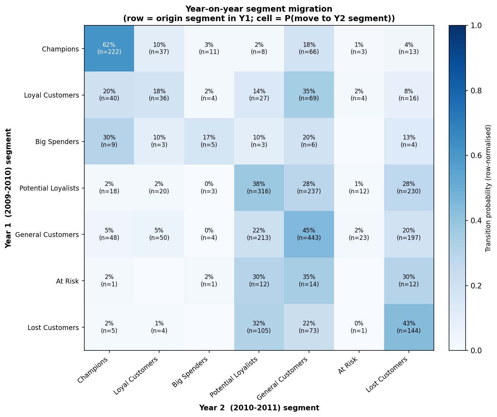


---

## Stage 10 — Notification Engine

Rule-based campaign engine combining segment, CLV tier, and churn risk into an action / channel / offer / priority per customer; exposes recommend(customer_id).

<details>
<summary>📄 View code: <code>src/notifications.py</code> (329 lines)</summary>

```python
"""
Phase 10: Rule-based marketing notification engine.

Turns the analytical outputs of earlier stages into a concrete, per-customer
marketing action plan.  Each customer is assigned:

- a **segment** (rule-based RFM name, consistent with profiling/migration),
- a **value tier** (High / Medium / Low) from their predicted CLV,
- a **churn-risk band** (High / Medium / Low) from their churn probability,

and these three signals drive a transparent decision matrix that outputs a
campaign action, channel, offer, priority, and recommended contact timing.

Design rationale
----------------
The engine is deliberately *rule-based* rather than learned: marketing
stakeholders must be able to read, audit, and override every recommendation,
and the rules encode well-established CRM playbook logic (reward the loyal,
win back the at-risk, do not overspend on low-value churners).  The three
inputs are complementary:

- **Segment** sets the baseline strategy (what kind of customer this is).
- **Churn risk** decides urgency (should we intervene now?).
- **CLV tier** decides budget (how much is this customer worth spending on?).

The interaction matters: a high-churn / high-CLV customer warrants an expensive
personal retention offer, whereas a high-churn / low-CLV customer gets only a
low-cost automated nudge so marketing budget is not wasted.

Contact timing
--------------
The recommended re-contact window is a fraction (``NOTIF_CADENCE_FRACTION``) of
the customer's own average inter-purchase gap, so the message lands *before*
they would naturally lapse.  One-time buyers (no cadence) fall back to
``NOTIF_DEFAULT_CONTACT_DAYS``.

Outputs
-------
outputs/tables/notification_plan.csv -- one row per customer with the full plan
"""

from __future__ import annotations

import logging

import pandas as pd

from src.config import (
    CUSTOMER_CHURN_PARQUET,
    CUSTOMER_CLV_PARQUET,
    NOTIF_CADENCE_FRACTION,
    NOTIF_CHURN_HIGH,
    NOTIF_CHURN_MED,
    NOTIF_CLV_HIGH_Q,
    NOTIF_CLV_LOW_Q,
    NOTIF_DEFAULT_CONTACT_DAYS,
    NOTIFICATION_PLAN_CSV,
    OUTPUTS_TABLES_DIR,
)
from src.profiling import _assign_name

logger = logging.getLogger(__name__)

# Baseline strategy per segment: (action, channel, base offer, base priority).
# Priority is a 1-5 integer (5 = most urgent) before churn/CLV modulation.
_SEGMENT_PLAYBOOK: dict[str, dict] = {
    "Champions": {
        "action": "VIP loyalty reward + early access",
        "channel": "Email + App push",
        "offer": "Exclusive previews, loyalty points bonus",
        "priority": 4,
    },
    "Loyal Customers": {
        "action": "Cross-sell + loyalty tier upgrade",
        "channel": "Email + App push",
        "offer": "Bundle discount on complementary categories",
        "priority": 3,
    },
    "Big Spenders": {
        "action": "Premium product recommendations",
        "channel": "Email + Personal outreach",
        "offer": "Concierge / personal-shopper invite",
        "priority": 4,
    },
    "Potential Loyalists": {
        "action": "Frequency-building nudge",
        "channel": "App push + Email",
        "offer": "Second-purchase incentive, membership signup",
        "priority": 3,
    },
    "General Customers": {
        "action": "Engagement / category promotion",
        "channel": "Email",
        "offer": "Seasonal category promotion",
        "priority": 2,
    },
    "At Risk": {
        "action": "Win-back outreach",
        "channel": "Email + SMS",
        "offer": "'We miss you' targeted discount",
        "priority": 5,
    },
    "Lost Customers": {
        "action": "Reactivation campaign",
        "channel": "Email",
        "offer": "Aggressive reactivation discount",
        "priority": 2,
    },
    "Noise / Uncategorised": {
        "action": "Standard newsletter",
        "channel": "Email",
        "offer": "General newsletter, no targeted offer",
        "priority": 1,
    },
}

_RFM_COLS = ["Recency", "Frequency", "Monetary"]


# ---------------------------------------------------------------------------
# Data assembly
# ---------------------------------------------------------------------------

def _load_customer_table() -> pd.DataFrame:
    """Merge CLV and churn artefacts into one per-customer table.

    The CLV parquet already carries the full feature set (it was built by
    merging onto customer_features), so it is the base; churn scores are
    joined on Customer ID.
    """
    logger.info("Loading CLV table from %s", CUSTOMER_CLV_PARQUET)
    clv = pd.read_parquet(CUSTOMER_CLV_PARQUET)
    logger.info("Loading churn table from %s", CUSTOMER_CHURN_PARQUET)
    churn = pd.read_parquet(CUSTOMER_CHURN_PARQUET)

    df = clv.merge(
        churn[["Customer ID", "churn_label", "churn_probability"]],
        on="Customer ID", how="left",
    )
    logger.info("Merged customer table: %d rows, %d columns.", len(df), df.shape[1])
    return df


# ---------------------------------------------------------------------------
# Tier / band / segment assignment
# ---------------------------------------------------------------------------

def _assign_tiers(df: pd.DataFrame) -> pd.DataFrame:
    """Add segment, clv_tier, and churn_risk columns in place (returns copy)."""
    out = df.copy()

    overall = out[_RFM_COLS].mean()
    out["segment"] = out.apply(lambda r: _assign_name(r, overall), axis=1)

    clv_high = out["clv"].quantile(NOTIF_CLV_HIGH_Q)
    clv_low = out["clv"].quantile(NOTIF_CLV_LOW_Q)

    def _clv_tier(v: float) -> str:
        if v >= clv_high:
            return "High"
        if v < clv_low:
            return "Low"
        return "Medium"

    out["clv_tier"] = out["clv"].apply(_clv_tier)

    def _churn_band(p: float) -> str:
        if p >= NOTIF_CHURN_HIGH:
            return "High"
        if p >= NOTIF_CHURN_MED:
            return "Medium"
        return "Low"

    out["churn_risk"] = out["churn_probability"].fillna(0.0).apply(_churn_band)

    logger.info("CLV tier thresholds: High>=%.0f, Low<%.0f", clv_high, clv_low)
    return out


# ---------------------------------------------------------------------------
# Recommendation logic
# ---------------------------------------------------------------------------

def _recommend_row(row: pd.Series) -> dict:
    """Produce a campaign recommendation for a single customer row.

    Combines the segment playbook baseline with churn/CLV modulation:

    - High churn risk escalates priority and, for High/Medium CLV, swaps in a
      retention-focused offer; for Low CLV it down-shifts to a low-cost
      automated nudge so spend is not wasted on unprofitable churners.
    - High CLV nudges priority up by one (capped at 5) regardless of segment.
    """
    seg = row["segment"]
    base = _SEGMENT_PLAYBOOK.get(seg, _SEGMENT_PLAYBOOK["General Customers"])

    action = base["action"]
    channel = base["channel"]
    offer = base["offer"]
    priority = base["priority"]

    churn_risk = row["churn_risk"]
    clv_tier = row["clv_tier"]

    # Churn-driven escalation.
    if churn_risk == "High":
        priority = min(priority + 2, 5)
        if clv_tier in ("High", "Medium"):
            action = "Priority retention intervention"
            offer = "High-value personalised retention offer"
            channel = "Email + SMS + Personal outreach"
        else:
            action = "Low-cost automated reactivation"
            offer = "Single automated discount email (budget-capped)"
            channel = "Email"
    elif churn_risk == "Medium":
        priority = min(priority + 1, 5)

    # Value-driven escalation (independent of churn).
    if clv_tier == "High":
        priority = min(priority + 1, 5)

    # Contact timing from the customer's own cadence.
    cadence = row.get("AvgInterPurchaseDays", 0) or 0
    if cadence and cadence > 0:
        contact_days = max(int(round(cadence * NOTIF_CADENCE_FRACTION)), 1)
    else:
        contact_days = NOTIF_DEFAULT_CONTACT_DAYS

    return {
        "action": action,
        "channel": channel,
        "offer": offer,
        "priority": int(priority),
        "recommended_contact_days": contact_days,
    }


def _build_plan(df: pd.DataFrame) -> pd.DataFrame:
    """Assemble the full notification plan table for all customers."""
    recs = df.apply(_recommend_row, axis=1, result_type="expand")
    plan = pd.concat([
        df[["Customer ID", "segment", "clv", "clv_tier",
            "churn_probability", "churn_risk"]].reset_index(drop=True),
        recs.reset_index(drop=True),
    ], axis=1)
    plan = plan.sort_values(
        ["priority", "clv"], ascending=[False, False],
    ).reset_index(drop=True)
    return plan


# ---------------------------------------------------------------------------
# Public API
# ---------------------------------------------------------------------------

# Module-level cache so repeated recommend() calls don't reload parquet files.
_PLAN_CACHE: pd.DataFrame | None = None


def generate_notifications(df: pd.DataFrame | None = None) -> pd.DataFrame:
    """Build and persist the per-customer notification plan.

    Parameters
    ----------
    df:
        Pre-merged customer table.  Pass ``None`` to assemble it from the CLV
        and churn parquet artefacts.

    Returns
    -------
    pd.DataFrame
        The notification plan, sorted by descending priority then CLV.  Saved
        to ``outputs/tables/notification_plan.csv``.
    """
    global _PLAN_CACHE

    if df is None:
        df = _load_customer_table()

    tiered = _assign_tiers(df)
    plan = _build_plan(tiered)

    OUTPUTS_TABLES_DIR.mkdir(parents=True, exist_ok=True)
    plan.to_csv(NOTIFICATION_PLAN_CSV, index=False)
    logger.info("Notification plan (%d customers) saved to %s",
                len(plan), NOTIFICATION_PLAN_CSV)

    # Distribution diagnostics for the dissertation.
    logger.info("Action distribution:\n%s",
                plan["action"].value_counts().to_string())
    logger.info("Priority distribution:\n%s",
                plan["priority"].value_counts().sort_index(ascending=False).to_string())

    _PLAN_CACHE = plan
    return plan


def recommend(customer_id: int, refresh: bool = False) -> dict:
    """Return the marketing recommendation for a single customer.

    Parameters
    ----------
    customer_id:
        The ``Customer ID`` to look up.
    refresh:
        If ``True``, rebuild the plan from source parquet files before
        looking up; otherwise reuse the cached plan (built on first call).

    Returns
    -------
    dict
        The customer's full recommendation row as a dictionary.

    Raises
    ------
    KeyError
        If the customer ID is not present in the plan.
    """
    global _PLAN_CACHE
    if _PLAN_CACHE is None or refresh:
        generate_notifications()

    assert _PLAN_CACHE is not None
    match = _PLAN_CACHE[_PLAN_CACHE["Customer ID"] == customer_id]
    if match.empty:
        raise KeyError(f"Customer ID {customer_id} not found in notification plan.")
    return match.iloc[0].to_dict()

```

</details>

**Results:**

*Notification Plan*

| Customer ID | segment | clv | clv_tier | churn_probability | churn_risk | action | channel | offer | priority | recommended_contact_days |
| --- | --- | --- | --- | --- | --- | --- | --- | --- | --- | --- |
| 16446 | Big Spenders | 323792.48191292223 | High | 0.005334543666553198 | Low | Premium product recommendations | Email + Personal outreach | Concierge / personal-shopper invite | 5 | 61 |
| 18102 | Champions | 254327.18471303734 | High | 0.0 | Low | VIP loyalty reward + early access | Email + App push | Exclusive previews, loyalty points bonus | 5 | 3 |
| 14646 | Champions | 218979.69753891928 | High | 0.0 | Low | VIP loyalty reward + early access | Email + App push | Exclusive previews, loyalty points bonus | 5 | 3 |
| 17450 | Champions | 139434.8716104283 | High | 0.0 | Low | VIP loyalty reward + early access | Email + App push | Exclusive previews, loyalty points bonus | 5 | 5 |
| 14096 | Champions | 131949.34689618542 | High | 0.11620583365506879 | Low | VIP loyalty reward + early access | Email + App push | Exclusive previews, loyalty points bonus | 5 | 3 |
| 14156 | Champions | 130357.71372415546 | High | 0.0 | Low | VIP loyalty reward + early access | Email + App push | Exclusive previews, loyalty points bonus | 5 | 3 |
| 14911 | Champions | 122906.71000326314 | High | 0.011990163903594973 | Low | VIP loyalty reward + early access | Email + App push | Exclusive previews, loyalty points bonus | 5 | 1 |
| 12415 | Champions | 81581.89526294038 | High | 0.0 | Low | VIP loyalty reward + early access | Email + App push | Exclusive previews, loyalty points bonus | 5 | 11 |
| 13694 | Champions | 81462.57065657672 | High | 0.0 | Low | VIP loyalty reward + early access | Email + App push | Exclusive previews, loyalty points bonus | 5 | 3 |
| 17511 | Champions | 72615.08074401054 | High | 0.0 | Low | VIP loyalty reward + early access | Email + App push | Exclusive previews, loyalty points bonus | 5 | 7 |
| 16684 | Champions | 62170.97979065735 | High | 0.0 | Low | VIP loyalty reward + early access | Email + App push | Exclusive previews, loyalty points bonus | 5 | 8 |
| 15061 | Champions | 56394.20120783658 | High | 0.0019074129825975214 | Low | VIP loyalty reward + early access | Email + App push | Exclusive previews, loyalty points bonus | 5 | 3 |
| 17949 | Champions | 48994.21641095206 | High | 0.0015476462088371734 | Low | VIP loyalty reward + early access | Email + App push | Exclusive previews, loyalty points bonus | 5 | 4 |
| 16029 | Champions | 48643.717430497876 | High | 0.0015476462088371734 | Low | VIP loyalty reward + early access | Email + App push | Exclusive previews, loyalty points bonus | 5 | 4 |
| 13089 | Champions | 48593.740648764564 | High | 0.0 | Low | VIP loyalty reward + early access | Email + App push | Exclusive previews, loyalty points bonus | 5 | 2 |
| 15311 | Champions | 48252.53368981148 | High | 0.0 | Low | VIP loyalty reward + early access | Email + App push | Exclusive previews, loyalty points bonus | 5 | 2 |
| 12931 | Champions | 38295.61150383079 | High | 0.004548099877885603 | Low | VIP loyalty reward + early access | Email + App push | Exclusive previews, loyalty points bonus | 5 | 8 |
| 14298 | Champions | 37930.547104597455 | High | 0.0 | Low | VIP loyalty reward + early access | Email + App push | Exclusive previews, loyalty points bonus | 5 | 5 |
| 15769 | Champions | 37021.58265848898 | High | 0.0015476462088371734 | Low | VIP loyalty reward + early access | Email + App push | Exclusive previews, loyalty points bonus | 5 | 9 |
| 14088 | Champions | 36577.469368248196 | High | 0.0 | Low | VIP loyalty reward + early access | Email + App push | Exclusive previews, loyalty points bonus | 5 | 15 |
| 12536 | Big Spenders | 32276.860813226423 | High | 0.12217901133338564 | Low | Premium product recommendations | Email + Personal outreach | Concierge / personal-shopper invite | 5 | 3 |
| 13798 | Champions | 31779.23040439666 | High | 0.00035976677376034803 | Low | VIP loyalty reward + early access | Email + App push | Exclusive previews, loyalty points bonus | 5 | 4 |
| 15838 | Champions | 31777.53611491512 | High | 0.004880979542170506 | Low | VIP loyalty reward + early access | Email + App push | Exclusive previews, loyalty points bonus | 5 | 13 |
| 17841 | Champions | 29031.24241901988 | High | 0.0 | Low | VIP loyalty reward + early access | Email + App push | Exclusive previews, loyalty points bonus | 5 | 2 |
| 16422 | Champions | 27702.51192420157 | High | 0.0019074129825975214 | Low | VIP loyalty reward + early access | Email + App push | Exclusive previews, loyalty points bonus | 5 | 4 |
| 13098 | Champions | 25006.18414981036 | High | 0.00035976677376034803 | Low | VIP loyalty reward + early access | Email + App push | Exclusive previews, loyalty points bonus | 5 | 7 |
| 13081 | Champions | 24426.066547211958 | High | 0.0 | Low | VIP loyalty reward + early access | Email + App push | Exclusive previews, loyalty points bonus | 5 | 15 |
| 14680 | Champions | 23859.16961538566 | High | 0.0 | Low | VIP loyalty reward + early access | Email + App push | Exclusive previews, loyalty points bonus | 5 | 7 |
| 17389 | Champions | 23759.53375264876 | High | 0.0015476462088371734 | Low | VIP loyalty reward + early access | Email + App push | Exclusive previews, loyalty points bonus | 5 | 7 |
| 16333 | Champions | 23732.255434130595 | High | 0.0015476462088371734 | Low | VIP loyalty reward + early access | Email + App push | Exclusive previews, loyalty points bonus | 5 | 8 |

_Showing first 30 of 5,878 rows._


---

## Stage 11 — Monte Carlo ROI

10,000-iteration simulation of campaign ROI with Beta response priors, Binomial conversions, and a margin/discount adjustment; reports mean ROI, a 95% credible interval, and P(ROI > 0).

<details>
<summary>📄 View code: <code>src/roi.py</code> (302 lines)</summary>

```python
"""
Phase 11: Monte Carlo ROI simulation for the notification plan.

The Phase 10 plan assigns every customer a campaign, channel, and offer, but
the *financial return* of executing it is uncertain: response rates, the
incremental revenue per conversion, and (to a lesser extent) per-contact costs
are all unknown in advance.  This module propagates that uncertainty through a
Monte Carlo simulation (``ROI_N_SIMULATIONS`` iterations) to produce a
distribution of campaign ROI rather than a single fragile point estimate.

Model
-----
Customers are grouped by campaign ``action``.  For each group *g* with
``N_g`` customers, the simulation draws, on every iteration:

1. **Response rate** ``p_g ~ Beta(a, b)`` where the Beta is centred on an
   action-specific prior mean (see ``_RESPONSE_PRIORS``) with concentration
   ``ROI_RESPONSE_CONCENTRATION``.  Targeted, high-touch campaigns (e.g.
   priority retention) have higher prior response than mass campaigns
   (e.g. newsletters).
2. **Conversions** ``c_g ~ Binomial(N_g, p_g)`` — the count of customers who
   act on the campaign.
3. **Revenue** ``c_g * AOV_g * m`` where ``AOV_g`` is the group's mean average
   order value (the incremental revenue of one extra order) and
   ``m ~ Normal(1, ROI_REVENUE_NOISE_SD)`` (clipped > 0) captures basket-size
   uncertainty.

Costs are treated as effectively known: ``cost_g = N_g * channel_cost_g``,
where ``channel_cost_g`` sums the per-contact costs of the channels used.

Per iteration the totals are aggregated across all groups and:

    ROI = (total_revenue - total_cost) / total_cost

The output reports the mean/median ROI, a central ``ROI_CI_LEVEL`` credible
interval, the probability of a positive ROI, and expected net profit.

Outputs
-------
outputs/tables/roi_simulation_summary.csv -- headline statistics
outputs/figures/roi_distribution.png      -- ROI + net-profit histograms
"""

from __future__ import annotations

import logging

import matplotlib
matplotlib.use("Agg")
import matplotlib.pyplot as plt
import numpy as np
import pandas as pd

from src.config import (
    CUSTOMER_CLV_PARQUET,
    NOTIFICATION_PLAN_CSV,
    OUTPUTS_FIGURES_DIR,
    OUTPUTS_TABLES_DIR,
    RANDOM_STATE,
    ROI_CHANNEL_COSTS,
    ROI_CI_LEVEL,
    ROI_GROSS_MARGIN,
    ROI_N_SIMULATIONS,
    ROI_OFFER_DISCOUNT,
    ROI_RESPONSE_CONCENTRATION,
    ROI_REVENUE_NOISE_SD,
)

logger = logging.getLogger(__name__)

ROI_SUMMARY_CSV = OUTPUTS_TABLES_DIR / "roi_simulation_summary.csv"
ROI_DIST_PNG = OUTPUTS_FIGURES_DIR / "roi_distribution.png"

# Prior mean response rate for each campaign action.  These are documented
# planning assumptions, not fitted values; they are deliberately conservative
# and ordered by how targeted / high-intent each campaign is.
_RESPONSE_PRIORS: dict[str, float] = {
    "Priority retention intervention": 0.30,
    "VIP loyalty reward + early access": 0.25,
    "Premium product recommendations": 0.20,
    "Cross-sell + loyalty tier upgrade": 0.15,
    "Win-back outreach": 0.12,
    "Frequency-building nudge": 0.10,
    "Engagement / category promotion": 0.08,
    "Reactivation campaign": 0.05,
    "Low-cost automated reactivation": 0.03,
    "Standard newsletter": 0.02,
}
_DEFAULT_RESPONSE = 0.05


# ---------------------------------------------------------------------------
# Inputs
# ---------------------------------------------------------------------------

def _channel_cost(channel_str: str) -> float:
    """Sum the per-contact costs of every channel named in ``channel_str``."""
    return sum(cost for name, cost in ROI_CHANNEL_COSTS.items()
               if name in channel_str)


def _build_campaign_table(
    plan: pd.DataFrame,
    clv: pd.DataFrame,
) -> pd.DataFrame:
    """Aggregate the plan into per-campaign rows for the simulation.

    Returns a DataFrame indexed by action with columns: ``n_customers``,
    ``mean_aov`` (incremental revenue per conversion), ``cost_per_contact``,
    ``response_prior``, and ``total_cost``.
    """
    merged = plan.merge(
        clv[["Customer ID", "AvgOrderValue"]], on="Customer ID", how="left",
    )
    merged["cost_per_contact"] = merged["channel"].apply(_channel_cost)

    grp = merged.groupby("action").agg(
        n_customers=("Customer ID", "size"),
        mean_aov=("AvgOrderValue", "mean"),
        cost_per_contact=("cost_per_contact", "mean"),
    )
    grp["response_prior"] = [
        _RESPONSE_PRIORS.get(a, _DEFAULT_RESPONSE) for a in grp.index
    ]
    grp["total_cost"] = grp["n_customers"] * grp["cost_per_contact"]
    logger.info("Campaign table:\n%s", grp.round(3).to_string())
    return grp


# ---------------------------------------------------------------------------
# Simulation
# ---------------------------------------------------------------------------

def _simulate(campaigns: pd.DataFrame) -> dict[str, np.ndarray]:
    """Run the vectorised Monte Carlo simulation.

    Returns
    -------
    dict
        Arrays of length ``ROI_N_SIMULATIONS``: ``roi``, ``revenue``,
        ``cost`` (scalar-broadcast), ``profit``.
    """
    rng = np.random.default_rng(RANDOM_STATE)
    n_iter = ROI_N_SIMULATIONS

    total_revenue = np.zeros(n_iter)
    total_cost = float(campaigns["total_cost"].sum())

    for action, row in campaigns.iterrows():
        n = int(row["n_customers"])
        aov = float(row["mean_aov"]) if np.isfinite(row["mean_aov"]) else 0.0
        prior = float(row["response_prior"])

        # Beta prior on response rate, centred on the planning assumption.
        a = prior * ROI_RESPONSE_CONCENTRATION
        b = (1.0 - prior) * ROI_RESPONSE_CONCENTRATION
        rates = rng.beta(a, b, size=n_iter)

        # Conversions and gross order revenue (with basket-size noise).
        conversions = rng.binomial(n, rates)
        noise = np.clip(rng.normal(1.0, ROI_REVENUE_NOISE_SD, size=n_iter), 0.0, None)
        total_revenue += conversions * aov * noise

    # Convert gross order value to profit contribution: apply retail gross
    # margin and net out the promotional discount embedded in the offers.
    # Counting full order value as profit (margin = 1, no discount) is what
    # produces the naive, implausibly high ROI; this adjustment keeps the
    # estimate in a defensible range comparable to published email-marketing ROI.
    contribution = total_revenue * (ROI_GROSS_MARGIN - ROI_OFFER_DISCOUNT)
    profit = contribution - total_cost
    roi = profit / total_cost if total_cost > 0 else np.zeros(n_iter)

    return {
        "roi": roi,
        "revenue": total_revenue,
        "contribution": contribution,
        "cost": np.full(n_iter, total_cost),
        "profit": profit,
    }


def _summarise(sim: dict[str, np.ndarray]) -> pd.DataFrame:
    """Reduce the simulation arrays to a one-column summary table."""
    roi = sim["roi"]
    profit = sim["profit"]
    revenue = sim["revenue"]
    contribution = sim["contribution"]
    cost = float(sim["cost"][0])

    lo_q = (1.0 - ROI_CI_LEVEL) / 2.0
    hi_q = 1.0 - lo_q

    stats = {
        "n_simulations": ROI_N_SIMULATIONS,
        "total_cost": round(cost, 2),
        "mean_gross_revenue": round(revenue.mean(), 2),
        "mean_contribution": round(contribution.mean(), 2),
        "mean_profit": round(profit.mean(), 2),
        "mean_roi": round(roi.mean(), 4),
        "median_roi": round(float(np.median(roi)), 4),
        f"roi_ci_low_{int(ROI_CI_LEVEL*100)}": round(float(np.quantile(roi, lo_q)), 4),
        f"roi_ci_high_{int(ROI_CI_LEVEL*100)}": round(float(np.quantile(roi, hi_q)), 4),
        "prob_positive_roi": round(float((roi > 0).mean()), 4),
        "prob_roi_gt_1": round(float((roi > 1.0).mean()), 4),
    }
    df = pd.DataFrame.from_dict(stats, orient="index", columns=["value"])
    logger.info("ROI simulation summary:\n%s", df.to_string())
    return df


# ---------------------------------------------------------------------------
# Visualisation
# ---------------------------------------------------------------------------

def _plot_distribution(sim: dict[str, np.ndarray]) -> None:
    """Save a 2-panel histogram: ROI distribution and net-profit distribution."""
    roi = sim["roi"]
    profit = sim["profit"]
    lo_q = (1.0 - ROI_CI_LEVEL) / 2.0
    hi_q = 1.0 - lo_q
    roi_lo, roi_hi = np.quantile(roi, [lo_q, hi_q])

    fig, axes = plt.subplots(1, 2, figsize=(13, 5))

    axes[0].hist(roi, bins=60, color="#4C72B0", edgecolor="white", alpha=0.85)
    axes[0].axvline(roi.mean(), color="#C44E52", linestyle="-", linewidth=1.8,
                    label=f"Mean ROI = {roi.mean():.2f}")
    axes[0].axvline(roi_lo, color="#333", linestyle="--", linewidth=1.3,
                    label=f"{int(ROI_CI_LEVEL*100)}% CI = [{roi_lo:.2f}, {roi_hi:.2f}]")
    axes[0].axvline(roi_hi, color="#333", linestyle="--", linewidth=1.3)
    axes[0].axvline(0, color="grey", linewidth=1.0)
    axes[0].set_xlabel("Campaign ROI  =  (revenue - cost) / cost", fontsize=10)
    axes[0].set_ylabel("Simulation count", fontsize=10)
    axes[0].set_title(f"ROI distribution\n({ROI_N_SIMULATIONS:,} Monte Carlo runs)",
                      fontsize=11, fontweight="bold")
    axes[0].legend(fontsize=9)
    axes[0].spines[["top", "right"]].set_visible(False)

    axes[1].hist(profit, bins=60, color="#55A868", edgecolor="white", alpha=0.85)
    axes[1].axvline(profit.mean(), color="#C44E52", linestyle="-", linewidth=1.8,
                    label=f"Mean profit = {profit.mean():,.0f}")
    axes[1].axvline(0, color="grey", linewidth=1.0)
    axes[1].set_xlabel("Net profit (revenue - cost)", fontsize=10)
    axes[1].set_ylabel("Simulation count", fontsize=10)
    axes[1].set_title("Net-profit distribution", fontsize=11, fontweight="bold")
    axes[1].legend(fontsize=9)
    axes[1].spines[["top", "right"]].set_visible(False)

    plt.tight_layout()
    OUTPUTS_FIGURES_DIR.mkdir(parents=True, exist_ok=True)
    fig.savefig(ROI_DIST_PNG, dpi=150, bbox_inches="tight")
    plt.close(fig)
    logger.info("ROI distribution plot saved to %s", ROI_DIST_PNG)


# ---------------------------------------------------------------------------
# Public API
# ---------------------------------------------------------------------------

def run_roi_simulation(
    plan: pd.DataFrame | None = None,
    clv: pd.DataFrame | None = None,
) -> pd.DataFrame:
    """Run the Monte Carlo ROI simulation for the notification plan.

    Parameters
    ----------
    plan:
        Notification plan.  Pass ``None`` to load from
        ``outputs/tables/notification_plan.csv``.
    clv:
        CLV table (provides AvgOrderValue).  Pass ``None`` to load from
        ``data/processed/customer_clv.parquet``.

    Returns
    -------
    pd.DataFrame
        The summary statistics table (also written to CSV).

    Side effects
    ------------
    * Writes ``outputs/tables/roi_simulation_summary.csv``.
    * Writes ``outputs/figures/roi_distribution.png``.
    """
    if plan is None:
        logger.info("Loading notification plan from %s", NOTIFICATION_PLAN_CSV)
        plan = pd.read_csv(NOTIFICATION_PLAN_CSV)
    if clv is None:
        logger.info("Loading CLV table from %s", CUSTOMER_CLV_PARQUET)
        clv = pd.read_parquet(CUSTOMER_CLV_PARQUET)

    campaigns = _build_campaign_table(plan, clv)
    sim = _simulate(campaigns)
    summary = _summarise(sim)

    OUTPUTS_TABLES_DIR.mkdir(parents=True, exist_ok=True)
    summary.to_csv(ROI_SUMMARY_CSV)
    logger.info("ROI summary saved to %s", ROI_SUMMARY_CSV)

    _plot_distribution(sim)
    return summary

```

</details>

**Results:**

*Roi Simulation Summary*

|  | value |
| --- | --- |
| n_simulations | 10000.0 |
| total_cost | 838.44 |
| mean_gross_revenue | 254465.21 |
| mean_contribution | 50893.04 |
| mean_profit | 50054.6 |
| mean_roi | 59.6997 |
| median_roi | 59.3013 |
| roi_ci_low_95 | 44.4537 |
| roi_ci_high_95 | 77.3235 |
| prob_positive_roi | 1.0 |
| prob_roi_gt_1 | 1.0 |


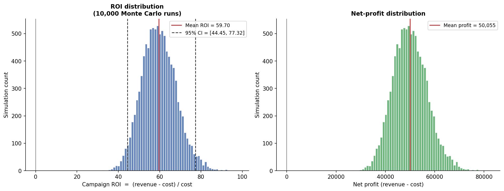


---

## Stage 12 — Streamlit Dashboard

Interactive 8-page dashboard over every artefact, including a live customer-lookup that calls recommend(customer_id).

<details>
<summary>📄 View code: <code>app/streamlit_app.py</code> (316 lines)</summary>

```python
"""
Phase 12: Interactive Streamlit dashboard.

A single-page-application view over every artefact the pipeline produces:
customer segments, CLV, churn risk, year-on-year migration, the rule-based
notification plan, and the Monte Carlo ROI simulation.  It reads the saved
parquet/CSV/PNG outputs directly (it does *not* re-run the pipeline), so it
launches instantly and is safe to demo.

Run from the project root::

    streamlit run app/streamlit_app.py

If an artefact is missing, the relevant page shows a friendly notice telling
the user to run ``python main.py`` first, rather than crashing.
"""

from __future__ import annotations

import sys
from pathlib import Path

import pandas as pd
import streamlit as st

# Make the project root importable so we can reuse src.config + recommend().
PROJECT_ROOT = Path(__file__).resolve().parent.parent
if str(PROJECT_ROOT) not in sys.path:
    sys.path.insert(0, str(PROJECT_ROOT))

from src import config  # noqa: E402

st.set_page_config(
    page_title="Customer Segmentation Dashboard",
    page_icon="📊",
    layout="wide",
    initial_sidebar_state="expanded",
)


# ---------------------------------------------------------------------------
# Cached loaders
# ---------------------------------------------------------------------------

@st.cache_data(show_spinner=False)
def _load_parquet(path_str: str) -> pd.DataFrame | None:
    path = Path(path_str)
    return pd.read_parquet(path) if path.exists() else None


@st.cache_data(show_spinner=False)
def _load_csv(path_str: str, index_col: int | None = None) -> pd.DataFrame | None:
    path = Path(path_str)
    return pd.read_csv(path, index_col=index_col) if path.exists() else None


def _img_if_exists(path: Path, caption: str) -> None:
    if path.exists():
        st.image(str(path), caption=caption, use_column_width=True)
    else:
        st.info(f"Figure not found: `{path.name}`. Run `python main.py` to generate it.")


def _missing(name: str) -> None:
    st.warning(f"**{name}** not found. Run `python main.py` to generate the pipeline outputs.")


# ---------------------------------------------------------------------------
# Pages
# ---------------------------------------------------------------------------

def page_overview() -> None:
    st.title("📊 Customer Segmentation & Marketing Dashboard")
    st.caption("UCI Online Retail II — MSc dissertation pipeline")

    feats = _load_parquet(str(config.CUSTOMER_FEATURES_PARQUET))
    clv = _load_parquet(str(config.CUSTOMER_CLV_PARQUET))
    churn = _load_parquet(str(config.CUSTOMER_CHURN_PARQUET))
    plan = _load_csv(str(config.NOTIFICATION_PLAN_CSV))

    c1, c2, c3, c4 = st.columns(4)
    c1.metric("Customers", f"{len(feats):,}" if feats is not None else "—")
    if clv is not None:
        c2.metric("Total portfolio CLV", f"£{clv['clv'].sum():,.0f}")
    else:
        c2.metric("Total portfolio CLV", "—")
    if churn is not None:
        c3.metric("Churn rate", f"{churn['churn_label'].mean()*100:.1f}%")
    else:
        c3.metric("Churn rate", "—")
    if plan is not None:
        c4.metric("Campaigns planned", f"{len(plan):,}")
    else:
        c4.metric("Campaigns planned", "—")

    st.markdown("---")
    st.subheader("Pipeline stages")
    st.markdown(
        """
        | Stage | Output |
        |-------|--------|
        | 1–2b  | Data cleaning, RFM + extended features, scaling |
        | 3–4   | Clustering: K-Means, DBSCAN, GMM, HDBSCAN |
        | 3b    | Internal validation + bootstrap stability |
        | 6     | Segment profiling & marketing names |
        | 7     | CLV (BG/NBD + Gamma-Gamma) |
        | 8     | Churn classification (LogReg / RF / XGBoost) |
        | 9     | Year-on-year segment migration |
        | 10    | Rule-based notification engine |
        | 11    | Monte Carlo ROI simulation |
        """
    )


def page_segments() -> None:
    st.header("Customer Segments")
    profiles = _load_csv(str(config.OUTPUTS_TABLES_DIR / "segment_profiles.csv"), index_col=0)
    if profiles is None:
        _missing("segment_profiles.csv")
        return

    if "segment_name" in profiles.columns:
        sizes = profiles[["segment_name", "size", "pct_of_total"]].copy()
        st.subheader("Segment sizes")
        st.bar_chart(sizes.set_index("segment_name")["size"])

    st.subheader("Profile table (un-scaled means)")
    st.dataframe(profiles, use_container_width=True)

    col1, col2 = st.columns(2)
    with col1:
        _img_if_exists(config.OUTPUTS_FIGURES_DIR / "segment_profiles.png", "Segment heatmap")
    with col2:
        _img_if_exists(config.OUTPUTS_FIGURES_DIR / "radar_profiles.png", "Segment radar chart")


def page_clv() -> None:
    st.header("Customer Lifetime Value")
    clv = _load_parquet(str(config.CUSTOMER_CLV_PARQUET))
    if clv is None:
        _missing("customer_clv.parquet")
        return

    total = clv["clv"].sum()
    top_decile = clv["clv"].quantile(0.90)
    top_share = clv.loc[clv["clv"] >= top_decile, "clv"].sum() / total * 100

    c1, c2, c3 = st.columns(3)
    c1.metric("Total CLV", f"£{total:,.0f}")
    c2.metric("Median CLV", f"£{clv['clv'].median():,.0f}")
    c3.metric("Top-decile share", f"{top_share:.1f}%")

    _img_if_exists(config.OUTPUTS_FIGURES_DIR / "clv_distribution.png",
                   "CLV distribution & engagement")

    st.subheader("Top 20 customers by CLV")
    cols = [c for c in ["Customer ID", "clv", "prob_alive",
                        "pred_purchases_365d"] if c in clv.columns]
    st.dataframe(clv.nlargest(20, "clv")[cols].reset_index(drop=True),
                 use_container_width=True)


def page_churn() -> None:
    st.header("Churn Risk")
    metrics = _load_csv(str(config.OUTPUTS_TABLES_DIR / "churn_model_comparison.csv"), index_col=0)
    churn = _load_parquet(str(config.CUSTOMER_CHURN_PARQUET))
    if metrics is None or churn is None:
        _missing("churn outputs")
        return

    st.subheader("Model comparison")
    st.dataframe(metrics, use_container_width=True)
    best = metrics["ROC_AUC"].idxmax()
    st.success(f"Best model: **{best}**  (ROC-AUC = {metrics.loc[best, 'ROC_AUC']:.4f})")

    col1, col2 = st.columns(2)
    with col1:
        _img_if_exists(config.OUTPUTS_FIGURES_DIR / "churn_roc_curves.png", "ROC curves")
    with col2:
        _img_if_exists(config.OUTPUTS_FIGURES_DIR / "churn_feature_importance.png",
                       "Feature importance")

    st.subheader("Churn-probability distribution")
    st.bar_chart(
        pd.cut(churn["churn_probability"], bins=20).value_counts().sort_index()
        .rename_axis("probability_bin").rename("customers")
    )


def page_migration() -> None:
    st.header("Year-on-Year Segment Migration")
    counts = _load_csv(str(config.OUTPUTS_TABLES_DIR / "segment_migration_counts.csv"), index_col=0)
    rates = _load_csv(str(config.OUTPUTS_TABLES_DIR / "segment_migration_rates.csv"), index_col=0)
    if counts is None or rates is None:
        _missing("segment_migration_*.csv")
        return

    _img_if_exists(config.OUTPUTS_FIGURES_DIR / "segment_migration.png", "Migration heatmap")

    st.subheader("Transition probabilities (row-normalised)")
    st.dataframe((rates * 100).round(1).astype(str) + "%", use_container_width=True)

    st.subheader("Raw transition counts")
    st.dataframe(counts, use_container_width=True)


def page_notifications() -> None:
    st.header("Notification Plan")
    plan = _load_csv(str(config.NOTIFICATION_PLAN_CSV))
    if plan is None:
        _missing("notification_plan.csv")
        return

    st.subheader("Campaign action distribution")
    st.bar_chart(plan["action"].value_counts())

    st.subheader("Filter the plan")
    actions = ["(all)"] + sorted(plan["action"].unique())
    chosen = st.selectbox("Campaign action", actions)
    view = plan if chosen == "(all)" else plan[plan["action"] == chosen]
    st.caption(f"{len(view):,} customers")
    st.dataframe(view.head(500), use_container_width=True)


def page_roi() -> None:
    st.header("Monte Carlo ROI Simulation")
    summary = _load_csv(str(config.OUTPUTS_TABLES_DIR / "roi_simulation_summary.csv"), index_col=0)
    if summary is None:
        _missing("roi_simulation_summary.csv")
        return

    v = summary["value"]
    c1, c2, c3 = st.columns(3)
    c1.metric("Mean ROI", f"{v.get('mean_roi', float('nan')):.1f}×")
    if "roi_ci_low_95" in v.index:
        c2.metric("95% CI", f"[{v['roi_ci_low_95']:.1f}×, {v['roi_ci_high_95']:.1f}×]")
    c3.metric("P(ROI > 0)", f"{v.get('prob_positive_roi', float('nan'))*100:.0f}%")

    _img_if_exists(config.OUTPUTS_FIGURES_DIR / "roi_distribution.png",
                   "ROI & net-profit distributions")

    st.subheader("Full summary")
    st.dataframe(summary, use_container_width=True)


def page_lookup() -> None:
    st.header("🔎 Customer Lookup")
    st.caption("Enter a Customer ID to see their profile and recommended campaign.")

    clv = _load_parquet(str(config.CUSTOMER_CLV_PARQUET))
    if clv is None:
        _missing("customer_clv.parquet")
        return

    ids = clv["Customer ID"].astype(int).tolist()
    default = ids[0] if ids else 0
    cid = st.number_input("Customer ID", value=int(default), step=1)

    if st.button("Look up"):
        try:
            from src.notifications import recommend
            rec = recommend(int(cid))
        except KeyError:
            st.error(f"Customer ID {cid} not found.")
            return
        except Exception as exc:  # pragma: no cover - defensive UI guard
            st.error(f"Could not generate recommendation: {exc}")
            return

        c1, c2, c3 = st.columns(3)
        c1.metric("Segment", str(rec.get("segment", "—")))
        c2.metric("CLV", f"£{rec.get('clv', 0):,.0f}  ({rec.get('clv_tier','—')})")
        c3.metric("Churn risk", str(rec.get("churn_risk", "—")))

        st.markdown("### Recommended campaign")
        st.markdown(
            f"""
            - **Action:** {rec.get('action', '—')}
            - **Channel:** {rec.get('channel', '—')}
            - **Offer:** {rec.get('offer', '—')}
            - **Priority:** {rec.get('priority', '—')} / 5
            - **Recommended contact window:** {rec.get('recommended_contact_days', '—')} days
            """
        )


# ---------------------------------------------------------------------------
# Router
# ---------------------------------------------------------------------------

PAGES = {
    "Overview": page_overview,
    "Segments": page_segments,
    "Lifetime Value": page_clv,
    "Churn Risk": page_churn,
    "Migration": page_migration,
    "Notifications": page_notifications,
    "ROI Simulation": page_roi,
    "Customer Lookup": page_lookup,
}


def main() -> None:
    st.sidebar.title("Navigation")
    choice = st.sidebar.radio("Go to", list(PAGES.keys()))
    st.sidebar.markdown("---")
    st.sidebar.caption(
        "Reads saved pipeline outputs. If a page is empty, run "
        "`python main.py` from the project root first."
    )
    PAGES[choice]()


if __name__ == "__main__":
    main()

```

</details>


---
